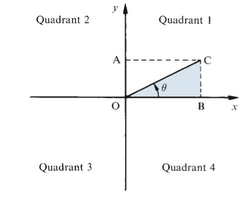

### Chapter 23: The trigonometric functions and their graphs

#### 23.1: Extended definition of the trigonometric ratios

We used a right-angled triangle in order o define the three tri ratios.
The angle θ is thus limited to a maximum value of 90deg. To give meaning to the trigonometric rations of angles greater
than 90deg we introduce an extended definition.

**Quadrants**

The _x_ and _y_ axes divide the plane into four quadrants.

**Projections**
