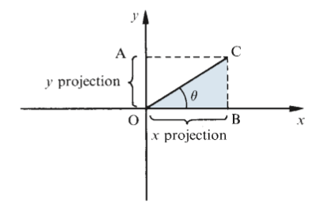

### Chapter 23: The trigonometric functions and their graphs

#### 23.1: Extended definition of the trigonometric ratios

We used a right-angled triangle in order to define the three tri ratios.
The angle θ is thus limited to a maximum value of 90deg. To give meaning to the trigonometric rations of angles greater
than 90deg we introduce an extended definition.

**Quadrants**

The _x_ and _y_ axes divide the plane into four quadrants.

**Projections**

We consider the _x_ and _y_ projections if the arm OC. These are illustrated in the figure. We label the _x_ projection OB and the _y_ projection OA. One or both of these projections can be negative, depending upon the position of the arm OC. However the length of the arm itself is always considered to be positive.

Key points:

\[
\sin\theta = \frac{\text{y projection of arm OC}}{OC} = \frac{\text{OA}}{OC}
\]

\[
\cos\theta = \frac{\text{x projection of arm OC}}{OC} = \frac{\text{OB}}{OC}
\]

\[
\tan\theta = \frac{\text{y projection of arm OC}}{x projection of arm OC} = \frac{\text{OA}}{OB}
\]

Key points:

#### 23.2: Trigonometric functions and their graphs

### Chapter 24: Trigonometrical identities and equations

#### 24.1: Trigonometric identities

At first sight, an identity looks like an equation.
The crucial and important difference is that the left-hand side and the right-hand side of an identity are equal for all values of the variable involved.

\[
\frac{\text{sin 𝜃}}{\text{cos 𝜃}} = {\text{sin 𝜃}}
\]
