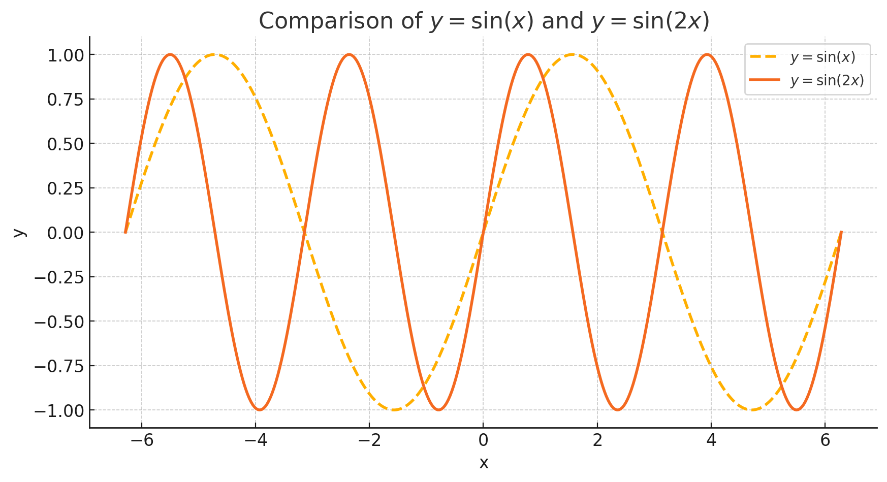

### Trigonometric functions, plots and properties

1. **Which of the following statements is true about the cosine function?**

- Cosine is an odd function
- Cosine 𝜃 is equal to cosine of -𝜃
- Cosine of 𝜃 has a period of 𝜋
- Cosine of -𝜃 is equal to -cos(𝜃)

  
Solution

The correct statement is:

**Cosine 𝜃 is equal to cosine of -𝜃**

Explanation:\*\*

1. **Cosine is an odd function:**
   This is false. A function \( f(\theta) \) is odd if \( f(-\theta) = -f(\theta) \). However, cosine is an even function because \( \cos(-\theta) = \cos(\theta) \).

2. **Cosine 𝜃 is equal to cosine of -𝜃:**
   This is true. As mentioned, cosine is an even function, so \( \cos(-\theta) = \cos(\theta) \).

3. **Cosine of 𝜃 has a period of ∏:**
   This is false. The cosine function has a period of \( 2\pi \), not \( \pi \). (While some trigonometric functions or combinations might have a period of \( \pi \), the standard cosine function does not.)

4. **Cosine of -𝜃 is equal to -cos(𝜃):**
   This is false. Again, since cosine is even, \( \cos(-\theta) = \cos(\theta) \), not \(-\cos(\theta)\).

Thus, the only true statement is that cosine of 𝜃 is equal to cosine of -𝜃.

 

2. **Prove that the cosine function is an even function**

  
Solution

There are several ways to prove that the cosine function is an even function. Below are three common approaches:

---

**1. Using the Unit Circle**

Recall that on the unit circle, for an angle \( \theta \), the coordinates of the corresponding point are given by \((\cos\theta, \sin\theta)\).

- When you consider the angle \(-\theta\), you are reflecting the point across the \(x\)-axis. The new point becomes \((\cos(-\theta), \sin(-\theta))\).
- Since reflection across the \(x\)-axis leaves the \(x\)-coordinate unchanged and flips the sign of the \(y\)-coordinate, we have:
  \[
  \cos(-\theta) = \cos(\theta) \quad \text{and} \quad \sin(-\theta) = -\sin(\theta).
  \]

This shows directly that the cosine function is even:
\[
\cos(-\theta) = \cos(\theta).
\]

---

**2. Using the Taylor Series Expansion**

The cosine function can be expressed as a Taylor series around \(0\):
\[
\cos\theta = \sum\_{n=0}^{\infty} \frac{(-1)^n \theta^{2n}}{(2n)!}.
\]

Notice that every term in this series involves \(\theta\) raised to an even power. This means:
\[
\cos(-\theta) = \sum*{n=0}^{\infty} \frac{(-1)^n (-\theta)^{2n}}{(2n)!}.
\]
Since \((- \theta)^{2n} = \theta^{2n}\) (because the exponent is even), the series becomes:
\[
\cos(-\theta) = \sum*{n=0}^{\infty} \frac{(-1)^n \theta^{2n}}{(2n)!} = \cos(\theta).
\]

Thus, the Taylor series shows that:
\[
\cos(-\theta) = \cos(\theta).
\]

---

**3. Using Euler’s Formula**

Euler’s formula states that:
\[
e^{i\theta} = \cos\theta + i\sin\theta.
\]

From Euler’s formula, we can derive an expression for cosine:
\[
\cos\theta = \frac{e^{i\theta} + e^{-i\theta}}{2}.
\]

Now, consider \(\cos(-\theta)\):
\[
\cos(-\theta) = \frac{e^{-i\theta} + e^{i\theta}}{2}.
\]
Notice that this expression is identical to the expression for \(\cos\theta\):
\[
\cos(-\theta) = \frac{e^{i\theta} + e^{-i\theta}}{2} = \cos\theta.
\]

---

**Conclusion**

Each of the three methods—using the unit circle, Taylor series, or Euler's formula—demonstrates that:
\[
\cos(-\theta) = \cos\theta,
\]
which is the definition of an even function. Therefore, the cosine function is indeed an even function.

 

3. **What is the amplitude of the function y = 3sin(x)?**

- 2𝜋
- 1
- 𝜋
  3

  
Solution

 

The amplitude of a sine function in the form \( y = A\sin(x) \) is given by the absolute value of \( A \). In this case, \( A = 3 \), so the amplitude is:

\[
\text{Amplitude} = |3| = 3.
\]

Thus, the correct answer is **3**.

 

4. **Derive the identity for sin(2𝛼), using the angle addition formula.**

  
Solution

 

To derive the identity for \(\sin(2\alpha)\) using the angle addition formula, follow these steps:

1. **Start with the angle addition formula for sine:**

   \[
   \sin(\alpha + \beta) = \sin\alpha \cos\beta + \cos\alpha \sin\beta.
   \]

2. **Set \(\beta = \alpha\):**

   \[
   \sin(\alpha + \alpha) = \sin\alpha \cos\alpha + \cos\alpha \sin\alpha.
   \]

3. **Simplify the left-hand side:**

   \[
   \sin(2\alpha) = \sin\alpha \cos\alpha + \cos\alpha \sin\alpha.
   \]

4. **Combine like terms:**

   Since \(\sin\alpha \cos\alpha\) appears twice, we have:

   \[
   \sin(2\alpha) = 2\sin\alpha \cos\alpha.
   \]

Thus, the derived identity is:

\[
\boxed{\sin(2\alpha) = 2\sin\alpha \cos\alpha.}
\]

 

5. **If y = sin(2x), what is the period of the function?**

- 2𝜋
- 4𝜋
- $\frac{𝜋}{2}$
- 𝜋

  
Solution

 

The general formula for the period of the function \( \sin(kx) \) is:

\[
\text{Period} = \frac{2\pi}{|k|}.
\]

For the function \( y = \sin(2x) \), we have \( k = 2 \). Thus, the period is:

\[
\text{Period} = \frac{2\pi}{2} = \pi.
\]

So, the correct answer is **\(\pi\)**.

 

6. **Sketch the graph of y = sin(2x) and explain how it differs from the graph of y = sin(x)**

  
Solution

 

**Explanation of the Graph**

The plot compares the graphs of \( y = \sin(x) \) (dashed line) and \( y = \sin(2x) \) (solid line). Here’s how they differ:

1. **Period Change (Horizontal Compression)**

   - The period of \( y = \sin(x) \) is \( 2\pi \), meaning it completes one full cycle over \( 2\pi \).
   - The period of \( y = \sin(2x) \) is \( \pi \), meaning it completes one full cycle in half the distance.
   - As a result, \( y = \sin(2x) \) oscillates twice as frequently as \( y = \sin(x) \), compressing the waveform horizontally.

2. **Same Amplitude**

   - Both functions oscillate between -1 and 1, meaning their amplitude remains **unchanged**.

3. **Frequency Doubling**
   - Since the function \( y = \sin(2x) \) completes two full cycles in the same space where \( y = \sin(x) \) completes one, it has **twice the frequency**.

**Summary of Differences**

| Feature       | \( y = \sin(x) \)      | \( y = \sin(2x) \)                           |
| ------------- | ---------------------- | -------------------------------------------- |
| **Period**    | \( 2\pi \)             | \( \pi \)                                    |
| **Amplitude** | 1                      | 1                                            |
| **Frequency** | 1 cycle per \( 2\pi \) | 2 cycles per \( 2\pi \)                      |
| **Effect**    | Normal wave            | Horizontally compressed wave (twice as fast) |

The main takeaway is that **\( y = \sin(2x) \) is a horizontally compressed version of \( y = \sin(x) \), with twice the frequency but the same amplitude.**

 

7. **Which of the following describes an odd function?**

- f(x) = f(x + 2 𝜋)
- f(- x) = fx
- f(x) = -f(x + 𝜋)
- f(-x) = -f(x)

  
Solution

 

The correct answer is:

**\( f(-x) = -f(x) \)**

**Explanation:**

A function \( f(x) \) is **odd** if it satisfies the condition:

\[
f(-x) = -f(x)
\]

for all values of \( x \) in its domain. This means that the function has **rotational symmetry** about the origin—when you reflect it across the y-axis and then across the x-axis, it remains unchanged.

### **Checking the Given Options:**

1. **\( f(x) = f(x + 2\pi) \)**

   - This describes **periodicity**, not odd symmetry.
   - Example: \( \sin x \) satisfies \( \sin(x + 2\pi) = \sin x \), but that doesn't define whether it's odd.

2. **\( f(-x) = f(x) \)**

   - This describes an **even function**, not an odd function.
   - Example: \( \cos x \) satisfies \( \cos(-x) = \cos x \).

3. **\( f(x) = -f(x + \pi) \)**

   - This describes a function with **anti-periodicity** (like the sine function with period shift \( \pi \)).
   - Example: \( \sin(x) \) satisfies \( \sin(x + \pi) = -\sin(x) \), but this is different from the odd function definition.

4. **\( f(-x) = -f(x) \)** ✅
   - This is the correct condition for an odd function.
   - Example: \( f(x) = \sin x \) satisfies \( \sin(-x) = -\sin(x) \), proving it is odd.

**Final Answer:**

\[
\boxed{f(-x) = -f(x)}
\]

 

8. **Explain why y = 3sin(2x) has an amplitude of 3 and a period of 𝜋**

  
Solution

 

**Understanding the Function \( y = 3\sin(2x) \)**

The general form of a sine function is:

\[
y = A\sin(Bx)
\]

where:

- \( A \) represents the **amplitude** (the maximum value of the function).
- \( B \) affects the **period** of the function.

Now, let's analyze the given function:

\[
y = 3\sin(2x)
\]

---

**1. Amplitude of \( y = 3\sin(2x) \)**
The **amplitude** of a sine function is given by:

\[
\text{Amplitude} = |A|
\]

For \( y = 3\sin(2x) \), the coefficient \( A = 3 \). This means:

\[
\text{Amplitude} = |3| = 3.
\]

This means that the function oscillates between **+3 and -3** instead of the usual **+1 and -1** for \( \sin(x) \).

---

**2. Period of \( y = 3\sin(2x) \)**
The **period** of a sine function is given by the formula:

\[
\text{Period} = \frac{2\pi}{|B|}
\]

For \( y = 3\sin(2x) \), the coefficient \( B = 2 \). So, the period is:

\[
\text{Period} = \frac{2\pi}{2} = \pi.
\]

This means that the function completes **one full cycle** over an interval of \( \pi \), instead of the usual \( 2\pi \) for \( \sin(x) \). As a result, the graph is **horizontally compressed** (the wave oscillates twice as fast).

---

**Summary**
| Feature | Standard \( y = \sin(x) \) | Modified \( y = 3\sin(2x) \) |
|--------------|----------------|----------------|
| **Amplitude** | 1 | 3 |
| **Period** | \( 2\pi \) | \( \pi \) (compressed by a factor of 2) |

Thus, the amplitude is **3** because of the coefficient in front of sine, and the period is **\( \pi \)** because of the coefficient inside the sine function.

 

9. **The function y = sin x + $\frac{𝜋}{2}$ is equivalent to which of the following?**

- -cos(x)
- -sin(x)
- sin(x)
- cos(x)

  
Solution

 

We need to determine which function is equivalent to:

\[
y = \sin x + \frac{\pi}{2}
\]

**Step 1: Use the Sine Addition Formula**
The sine addition formula states:

\[
\sin(A + B) = \sin A \cos B + \cos A \sin B.
\]

Setting \( A = x \) and \( B = \frac{\pi}{2} \), we apply the formula:

\[
\sin \left(x + \frac{\pi}{2} \right) = \sin x \cos \frac{\pi}{2} + \cos x \sin \frac{\pi}{2}.
\]

**Step 2: Evaluate Trigonometric Values**
From known trigonometric values:

\[
\cos \frac{\pi}{2} = 0, \quad \sin \frac{\pi}{2} = 1.
\]

Substituting these:

\[
\sin \left(x + \frac{\pi}{2} \right) = \sin x (0) + \cos x (1).
\]

\[
= \cos x.
\]

**Step 3: Identify the Equivalent Expression**
Thus, we conclude:

\[
\sin \left(x + \frac{\pi}{2} \right) = \cos x.
\]

**Final Answer:**
\[
\boxed{\cos(x)}
\]

 
