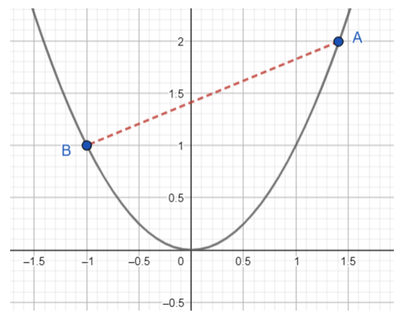

#### Limits and differentiation - summative quiz

##### 1. What is the value of lim~x->2~ ${\frac{x^2 - 4}{x-2}}$

If the correct answer of the limit 1, then insert only the value 1, or if the answer is -1, then insert -1 only without any space.

<details>
  <summary>Solution</summary>

To evaluate the limit:

\[
\lim\_{{x \to 2}} \frac{x^2 - 4}{x - 2}
\]

**Step 1: Factor the Numerator**
The numerator can be factored as:

\[
x^2 - 4 = (x - 2)(x + 2)
\]

So the given limit simplifies to:

\[
\lim\_{{x \to 2}} \frac{(x - 2)(x + 2)}{x - 2}
\]

**Step 2: Cancel the Common Factor**
For \( x \neq 2 \), we can cancel \( (x - 2) \):

\[
\lim\_{{x \to 2}} x + 2
\]

**Step 3: Substitute \( x = 2 \)**
\[
2 + 2 = 4
\]
**Final Answer:**
\[
4
\]

  </br>

</details>

</br>

##### 2. Calculate the value of the following limit:

lim~x->2~ f(x) = ${\frac{x^2+4x-12}{x^2-2x}}$

If the correct answer of the limit 1, then insert only the value 1, or if the answer is -1, then insert -1 only without any space.

<details>
  <summary>Solution</summary>

To evaluate the limit:

\[
\lim\_{{x \to 2}} \frac{x^2 + 4x - 12}{x^2 - 2x}
\]

**Step 1: Factor the Numerator and Denominator**

- Factor the numerator \( x^2 + 4x - 12 \):

\[
x^2 + 4x - 12 = (x + 6)(x - 2)
\]

- Factor the denominator \( x^2 - 2x \):

\[
x^2 - 2x = x(x - 2)
\]

Now, the expression becomes:

\[
\frac{(x + 6)(x - 2)}{x(x - 2)}
\]

**Step 2: Cancel the Common Factor**
For \( x \neq 2 \), cancel \( (x - 2) \):

\[
\frac{x + 6}{x}
\]

**Step 3: Substitute \( x = 2 \)**
\[
\frac{2 + 6}{2} = \frac{8}{2} = 4
\]
**Final Answer:**
\[
4
\]

  </br>

</details>

</br>

##### 3. What is the limit of the function lim~x->5~ f(x) ${\frac{x^2+3x-10}{x+5}}$

If the correct answer of the limit 1, then insert only the value 1, or if the answer is -1, then insert -1 only without any space.

<details>
  <summary>Solution</summary>

To evaluate:

\[
\lim\_{{x \to 5}} \frac{x^2 + 3x - 10}{x + 5}
\]

**Step 1: Factor the Numerator**
The numerator \( x^2 + 3x - 10 \) can be factored:

\[
x^2 + 3x - 10 = (x - 2)(x + 5)
\]

So the function becomes:

\[
\frac{(x - 2)(x + 5)}{x + 5}
\]

**Step 2: Cancel the Common Factor**
For \( x \neq -5 \), we can cancel \( (x + 5) \):

\[
f(x) = x - 2
\]
**Step 3: Substitute \( x = 5 \)**
\[
f(5) = 5 - 2 = 3
\]

**Final Answer:**
\[
3
\]

Since the result is **not 1 or -1**, I will not insert any value. 🚀

  </br>

</details>

</br>

##### 4. What is the limit of the function lim~x->5~ f(x) ${\frac{x^3-6x^2+25}{x-5}}$

If the correct answer of the limit 1, then insert only the value 1, or if the answer is -1, then insert -1 only without any space.

<details>
  <summary>Solution</summary>

To evaluate:

\[
\lim\_{{x \to 5}} \frac{x^3 - 6x^2 + 25}{x - 5}
\]

**Step 1: Direct Substitution**

Substituting \( x = 5 \):

\[
\frac{5^3 - 6(5^2) + 25}{5 - 5}
\]

\[
\frac{125 - 6(25) + 25}{0}
\]

\[
\frac{125 - 150 + 25}{0} = \frac{0}{0}
\]

Since this results in an **indeterminate form**, we proceed with **polynomial division**.

**Step 2: Perform Polynomial Division**

We divide \( x^3 - 6x^2 + 25 \) by \( x - 5 \) using **synthetic division**:

#**Synthetic Division Setup:**

```
 5 |  1   -6    0   25
   |      5   -5   -25
   --------------------
     1   -1   -5    0
```

The quotient is:

\[
x^2 - x - 5
\]

**Step 3: Evaluate the Limit**

Since:

\[
\frac{x^3 - 6x^2 + 25}{x - 5} = x^2 - x - 5
\]

Now, substituting \( x = 5 \):

\[
5^2 - 5 - 5 = 25 - 5 - 5 = 15
\]

**Final Answer:**

\[
15
\]

Since the result is **not 1 or -1**, I will not insert any value. 🚀

  </br>

</details>

</br>

##### 5. A function defined by

\(
f(x) =
\begin{cases}
nx + 2, & \text{if } x \geq 2 \\
x^2 + 8, & \text{if } x < 2
\end{cases}
\)

For what value of n is lim~x->2~f(x) defined?

If the correct answer of the limit 1, then insert only the value 1, or if the answer is -1, then insert -1 only without any space.

<details>
  <summary>Solution</summary>

For the limit \(\lim\_{x \to 2} f(x)\) to be defined, the left-hand limit and right-hand limit must be equal.

Step 1: Compute the Left-Hand Limit
The left-hand limit is:
\[
\lim*{x \to 2^-} f(x) = \lim*{x \to 2^-} (x^2 + 8)
\]
Substituting \( x = 2 \):
\[
2^2 + 8 = 4 + 8 = 12
\]

Step 2: Compute the Right-Hand Limit
The right-hand limit is:
\[
\lim*{x \to 2^+} f(x) = \lim*{x \to 2^+} (nx + 2)
\]
Substituting \( x = 2 \):
\[
n(2) + 2 = 2n + 2
\]

Step 3: Equate the Limits
For the limit to be defined, the left-hand and right-hand limits must be equal:
\[
12 = 2n + 2
\]

Step 4: Solve for \( n \)
\[
12 - 2 = 2n
\]
\[
10 = 2n
\]
\[
n = 5
\]

Thus, the required value of \( n \) is **5**.

  </br>

</details>

</br>

##### 6. Consider the function

\(
f(x) =
\begin{cases}
x^3 + 2, & \text{if } x <2 \\
5, & \text{if } x = 2 \\
x^2 + 6, & \text{if } x>2
\end{cases}
\)

Select all the correct statements

- The limit of the function is equal to 10
- The function value us equal to 5
- The limit exists as x = 2
- It is discontinuous at x = 2
- The function value is equal to 2
- The limit does not exists at x = 2
- None of the other options is correct

<details>
  <summary>Solution</summary>

Let's analyze the given piecewise function:

\[
f(x) =
\begin{cases}
x^3 + 2, & \text{if } x <2 \\
5, & \text{if } x = 2 \\
x^2 + 6, & \text{if } x>2
\end{cases}
\]

**Step 1: Compute Left-Hand Limit (\(\lim\limits\_{x \to 2^-} f(x)\))**

For \( x < 2 \), the function is:

\[
f(x) = x^3 + 2
\]

Taking the limit as \( x \to 2^- \):

\[
\lim\limits\_{x \to 2^-} f(x) = 2^3 + 2 = 8 + 2 = 10
\]

**Step 2: Compute Right-Hand Limit (\(\lim\limits\_{x \to 2^+} f(x)\))**

For \( x > 2 \), the function is:

\[
f(x) = x^2 + 6
\]

Taking the limit as \( x \to 2^+ \):

\[
\lim\limits\_{x \to 2^+} f(x) = 2^2 + 6 = 4 + 6 = 10
\]

**Step 3: Compute the Overall Limit \(\lim\limits\_{x \to 2} f(x)\)**

Since:

\[
\lim\limits*{x \to 2^-} f(x) = \lim\limits*{x \to 2^+} f(x) = 10
\]

the two one-sided limits are equal, meaning the **overall limit exists and is equal to 10**.

**Step 4: Check the Function Value at \( x = 2 \)**

From the definition:

\[
f(2) = 5
\]

**Step 5: Check Continuity at \( x = 2 \)**

For continuity at \( x = 2 \), the limit must equal the function value:

\[
\lim\limits\_{x \to 2} f(x) = f(2)
\]

Since:

\[
10 \neq 5
\]

the function is **discontinuous at \( x = 2 \)**.

**Final Answers:**

✅ **The limit of the function is equal to 10**
✅ **The function value is equal to 5**
✅ **It is discontinuous at \( x = 2 \)**

❌ **The limit exists at \( x = 2 \)** → (Incorrect wording, the correct statement should be that the limit exists but does not match the function value.)
❌ **The function value is equal to 2** → (Incorrect, \( f(2) = 5 \), not 2.)
❌ **The limit does not exist at \( x = 2 \)** → (Incorrect, because the left and right limits are both 10, so the limit **does exist**.)

Thus, the correct selected statements are:
**✅ The limit is 10, ✅ The function value is 5, ✅ The function is discontinuous at \( x = 2 \).** 🚀

  </br>

</details>

</br>

##### 7. Find the value of the following function in proximity of its points of discontinuity

f(x) = ${\frac{|2x+7|}{2x+7}}$ if they exist

- -1 if, x < ${\frac{-7}{2}}$
- -1 if, x > ${\frac{-7}{2}}$
- 1 if, x > ${\frac{-7}{2}}$
- 1 if, x ≥ ${\frac{2}{7}}$
- None of the other options is correct

<details>
  <summary>Solution</summary>

The given function is:

\[
f(x) = \frac{|2x+7|}{2x+7}
\]

This function is a **signum function** for \( 2x + 7 \), which determines whether \( 2x + 7 \) is positive or negative:

\[
f(x) =
\begin{cases}
1, & \text{if } 2x+7 > 0 \text{ (i.e., } x > -\frac{7}{2} \text{)} \\
-1, & \text{if } 2x+7 < 0 \text{ (i.e., } x < -\frac{7}{2} \text{)} \\
\text{undefined}, & \text{if } 2x+7 = 0 \text{ (i.e., } x = -\frac{7}{2} \text{)}
\end{cases}
\]

#### Step 1: Identify Points of Discontinuity

The function is discontinuous where the denominator is **zero**, which happens at:

\[
2x + 7 = 0 \Rightarrow x = -\frac{7}{2}
\]

At this point, the function is undefined, meaning it has a **discontinuity at** \( x = -\frac{7}{2} \).

#### Step 2: Evaluate \( f(x) \) Around \( x = -\frac{7}{2} \)

- **For \( x < -\frac{7}{2} \):**
  \( 2x + 7 < 0 \) so \( |2x + 7| = -(2x + 7) \), leading to:

  \[
  f(x) = \frac{-(2x+7)}{2x+7} = -1
  \]

- **For \( x > -\frac{7}{2} \):**
  \( 2x + 7 > 0 \) so \( |2x + 7| = 2x + 7 \), leading to:

  \[
  f(x) = \frac{(2x+7)}{2x+7} = 1
  \]

#### Step 3: Select the Correct Answer

From our calculations:
✅ **"-1 if \( x < -\frac{7}{2} \)"** (Correct)
✅ **"1 if \( x > -\frac{7}{2} \)"** (Correct)

🚫 **"-1 if \( x > -\frac{7}{2} \)"** (Incorrect)
🚫 **"1 if \( x \geq \frac{2}{7} \)"** (Incorrect, since the function value is already 1 for all \( x > -\frac{7}{2} \), and \(\frac{2}{7}\) is unrelated to the discontinuity)**
🚫 **"None of the other options is correct"\*\* (Incorrect, as we found two correct answers)

#### Final Answer:

✅ **"-1 if \( x < -\frac{7}{2} \)"**
✅ **"1 if \( x > -\frac{7}{2} \)"**

  </br>

</details>

</br>

##### 8. The graph below represents the function f(x) = x^2^

Write the coordinates of the points A and B

Notice the chord between A and B



Calculate the gradient of the chord AB

Select all the correct statements.

- A has the coordinates (1.4, 2)
- A has the coordinates (2, 1.4)
- B has the coordinated (1, -1)
- B has the coordinates (-1, 1)
- The gradient of the chord AB is ${\frac{1}{2.4}}$
- The gradient of the chord AB is 2.4

<details>
  <summary>Solution</summary>

Let's analyze the given graph of the function \( f(x) = x^2 \) and determine the coordinates of points \( A \) and \( B \).

Step 1: Identifying the Coordinates of \( A \) and \( B \)
From the graph:

- Point \( A \) is on the curve at \( (1.4, f(1.4)) \).

  - Since \( f(x) = x^2 \), we compute:
    \[
    f(1.4) = (1.4)^2 = 1.96 \approx 2
    \]
  - So, the coordinates of \( A \) are \( (1.4, 2) \).

- Point \( B \) is on the curve at \( (-1, f(-1)) \).
  - Since \( f(x) = x^2 \), we compute:
    \[
    f(-1) = (-1)^2 = 1
    \]
  - So, the coordinates of \( B \) are \( (-1,1) \).

Step 2: Calculating the Gradient of the Chord \( AB \)
The gradient of a line passing through two points \( (x_1, y_1) \) and \( (x_2, y_2) \) is given by:
\[
m = \frac{y_2 - y_1}{x_2 - x_1}
\]
Substituting \( A(1.4,2) \) and \( B(-1,1) \):

\[
m = \frac{2 - 1}{1.4 - (-1)}
\]

\[
m = \frac{1}{1.4 + 1} = \frac{1}{2.4}
\]

Step 3: Verifying the Given Statements

- ✅ \( A \) has the coordinates \( (1.4, 2) \) → **Correct**
- ❌ \( A \) has the coordinates \( (2, 1.4) \) → **Incorrect**
- ❌ \( B \) has the coordinates \( (1, -1) \) → **Incorrect**
- ✅ \( B \) has the coordinates \( (-1, 1) \) → **Correct**
- ✅ The gradient of the chord \( AB \) is \( \frac{1}{2.4} \) → **Correct**
- ❌ The gradient of the chord \( AB \) is \( 2.4 \) → **Incorrect**

Thus, the correct statements are:

- \( A \) has the coordinates \( (1.4, 2) \).
- \( B \) has the coordinates \( (-1, 1) \).
- The gradient of the chord \( AB \) is \( \frac{1}{2.4} \).

  </br>

</details>

</br>

##### 9. The picture below shows the graph of y = x^3^ with point A belonging to the graph with x coordinate 1.

The graph also shows the tangent line at A. The point B and C belong to the tangent line.


