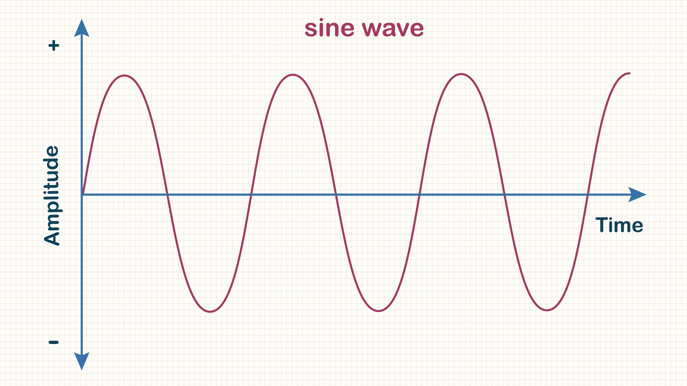
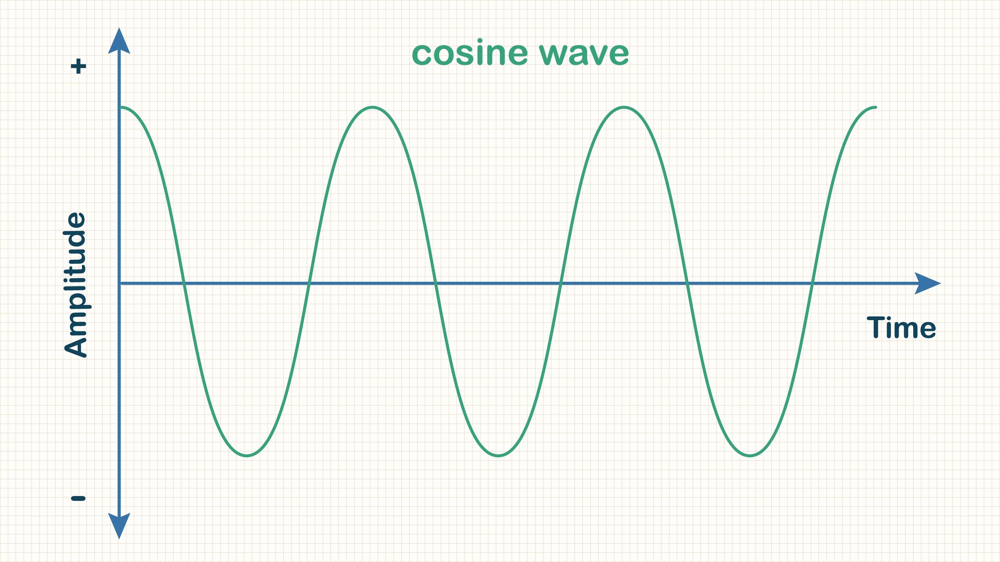

### 7.1 Introduction to triangles and trigonometry

  
1. The 2D Plane and Angles

   

- egrees: A full circle measures 360 degrees . A straight line defines an angle of 180 degrees.

- Direction: In this geometric space, movement is typically measured anticlockwise as a positive direction.

- Perpendicular: Dropping a perpendicular line divides a straight angle (180 degrees) exactly in half.

- Right Angle: The resulting 90-degree angle is a critical concept called a right angle.

 

  
2. General Triangle Properties

   

A triangle is formed by the intersection of three straight lines (segments).

- Standard Labeling: Angles are typically labeled with capital letters (A, B, C), and the side length opposite that angle is labeled with the corresponding lowercase letter (a, b, c).

- Angle Sum Property: The sum of the interior angles of any triangle is always 180 degrees ($A + B + C = 180^{\circ}$).

- Area Formula: The area of a triangle is calculated using its base ($b$) and perpendicular height ($h$):

$$\text{Area} = \frac{1}{2} \times \text{base} \times \text{height}$$

- Perimeter: The perimeter is simply the sum of the three side lengths ($a + b + c$).

   

  
3. Important triangle types

   

- Isosceles Triangle: A triangle that has two equal sides and, consequently, the two angles opposite those sides are also equal.

  - Example: If the third angle is $70^{\circ}$, the two equal angles must each be $55^{\circ}$ ($180 - 70 = 110$; $110 / 2 = 55$).

- Equilateral Triangle: A triangle where all three sides are equal and, consequently, all three angles are equal.

  - Since $3 \times A = 180^{\circ}$, each angle must be $\mathbf{60 \text{ degrees}}$.

- Similar Triangles: Two triangles are similar if their corresponding angles are identical. Their side lengths, sizes, and orientations may differ.

   

  
4. Right-Angled Triangles and Pythagoras

   

A right-angled triangle is a triangle that contains one 90-degree angle. This type of triangle has specialized terminology for its sides:

- Hypotenuse (H): The longest side, always opposite the 90-degree angle.

- Opposite (O): The side opposite the angle of interest (often labeled $\theta$).

- Adjacent (A): The side adjacent to (next to) the angle of interest ($\theta$), not the hypotenuse.

Pythagorean Theorem

This theorem relates the lengths of the sides of a right-angled triangle: the square of the hypotenuse is equal to the sum of the squares of the other two sides.

$$\text{Hypotenuse}^2 = \text{Opposite}^2 + \text{Adjacent}^2 \quad \text{or} \quad H^2 = O^2 + A^2$$

- Famous Example: The 3, 4, 5 triangle is the most famous right-angled triangle, as it satisfies the theorem: $5^2 = 3^2 + 4^2$, which simplifies to $25 = 9 + 16$.

   

### 7.2 The circle

  
1. Defining the Circle

 

A circle is entirely defined by a central point (the origin) and the radius ($r$).

- Radius ($r$): The distance from the origin to any point on the circle's edgeShutterstock.

Key Formulas

- Circumference (C): The distance around the circle is given by:$$C = 2 \pi r$$

- Area (A): The space enclosed by the circle is given by:$$A = \pi r^2$$

- Degrees: A full rotation around the circle measures 360 degrees ($360^{\circ}$).

The Number Pi ($\pi$)

The constant $\pi$ is an irrational number because its decimal expansion never repeats and cannot be written as a simple fraction ($p/q$). Because $\pi$ cannot be stored exactly in a computer, calculations involving circles require careful consideration of the necessary degree of accuracy (e.g., using significant figures or decimal points).

 

  
2. Radians: An Alternative Angle Measure

 

A radian is an angle measure defined by the relationship between the radius and the arc length of the circle.

- Definition: An angle $\theta$ is 1 radian when the length of the arc it subtends is equal to the length of the radius ($r$).

- Full Circle in Radians: The arc length for a full circle is the circumference, $2\pi r$. Since $r$ corresponds to 1 radian, the arc length of $2\pi r$ corresponds to $2\pi$ radians.

Converting Between Degrees and Radians

The relationship between the two units is critical for geometry and calculus:

$$360^{\circ} = 2\pi \text{ radians}$$

This allows for easy conversion between the two systems:

- Degrees to Radians:

$$\text{Radians} = \text{Degrees} \times \frac{2\pi}{360} \quad \text{or} \quad \text{Radians} = \text{Degrees} \times \frac{\pi}{180}$$

- Radians to Degrees:

$$\text{Degrees} = \text{Radians} \times \frac{180}{\pi}$$

 

### 7.3 From the circle to the sine and cosine graphs

  
1. Visualizing Sine and Cosine with the Unit Circle

 

The lecture uses the unit circle , which is a circle with a radius ($r$) of 1, to derive the meaning of sine and cosine.

A. Sine ($\sin$)

- Definition: The sine of an angle $\theta$ is defined by the height of a point on the unit circle above the origin (the $y$-coordinate). This height is the opposite side of the right-angled triangle formed by the radius.

- Sine Graph: Plotting this height as the angle traverses the circle results in the sine wave

Starts at 0 ($0^{\circ}$)._ Rises to a maximum of 1 ($90^{\circ}$)._ Drops to 0 ($180^{\circ}$)._ Drops to a minimum of -1 ($270^{\circ}$)._ Returns to 0 ($360^{\circ}$).

Unit Circle Formula: For $r=1$, $\sin(\theta)$ is simply equal to the length of the opposite side.

B. Cosine ($\cos$)

- Definition: The cosine of an angle $\theta$ is defined by the horizontal distance of a point on the unit circle from the origin (the $x$-coordinate). This distance is the adjacent side of the right-angled triangle.

- Cosine Graph: Plotting this horizontal distance results in the cosine wave

Starts at 1 ($0^{\circ}$)._ Drops to 0 ($90^{\circ}$)._ Drops to a minimum of -1 ($180^{\circ}$).\_ Rises to 0 ($270^{\circ}$).\_ Returns to 1 ($360^{\circ}$).Unit Circle Formula: For $r=1$, $\cos(\theta)$ is simply equal to the length of the adjacent side.

 

  
2. Generalizing to the Right-Angled Triangle

 

Since $\sin(\theta)$ and $\cos(\theta)$ for the unit circle only range between $-1$ and $1$, for any circle with a radius $H$ (the hypotenuse), the functions must be scaled by dividing by $H$.

The Trigonometric Ratios (SOH CAH TOA)

For any right-angled triangle:

|        Function         |                    Ratio                    | Acronym |
| :---------------------: | :-----------------------------------------: | :-----: |
|  Sine ($\sin \theta$)   | $\frac{\text{Opposite}}{\text{Hypotenuse}}$ |   SOH   |
| Cosine ($\cos \theta$)  | $\frac{\text{Adjacent}}{\text{Hypotenuse}}$ |   CAH   |
| Tangent ($\tan \theta$) |  $\frac{\text{Opposite}}{\text{Adjacent}}$  |   TOA   |

Tangent ($\tan$)

The tangent function is a measure of the gradient (slope) of the line forming the hypotenuse.

- Definition: $\tan \theta$ is the vertical change ($\text{Opposite}$) divided by the horizontal change ($\text{Adjacent}$).

- Relation to Sine and Cosine: This ratio can also be expressed as:

$$\tan \theta = \frac{\text{Opposite}/\text{Hypotenuse}}{\text{Adjacent}/\text{Hypotenuse}} = \frac{\sin \theta}{\cos \theta}$$

 
