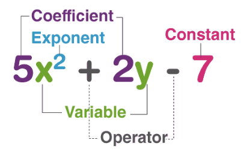

### Topic 2 A. Function

---

#### `The definition of a function`

  
Introduction

  
A function is a relation that assigns exactly one output to each input from a given set.

The concept of a funciton is a central to computer programming.

Most of what a programmer writes consists of "functions" that do parts of the work of the program.

 

  
Definition of a function

📘 Definition of a Function (Mathematics)

A function is a rule or relationship that assigns exactly one output to each input from a set.

🧮 Formal Definition:

Let 𝐴 and B be two sets.

A function f from A to B is a relation that associates every element
𝑥 ∈ 𝐴 with exactly one element y ∈ B.
We write:

𝑓: 𝐴 → 𝐵 such that f(x) = y

- A = domain (set of all valid inputs)
- B = codomain (set where outputs live)
- f(x) = the output of function

 

  
Terminology

  
Given a function: `f: A -> B`

`x ∈ A -> f(x) = y ∈ B`

A is the set of inputs and is called the domain of f. We write $D_f$ = A .
B is the set containing the outputs and is called the co-domain of f. We
write co-$D_f$ = B.

The set of outputs is called the range of f and it is written as $R_f$.

y is called the image of x, whereas x is called the pre-image of y.
We write `f(x) = y`

 

  
Domain, co-domain and range

   
  

 

Domain: $D_f$ = A = {on, sea, land, sky}

Co-domain: Co-$D_f$ = B = {1,2,3,4,5,6}

Range: $R_f$ = {2,3,4}

 

  
Images and pre-images

   
  
🔹 Image:
- The image of an input  x ∈ A is the output f(x) ∈ B.
- It answers: "What value does this input map to?"

✅ Example:

If f(x) = $x^2$, then:

- The image of 3 is f(3 )= 9
- The image of -3 is also 9

🔸 Pre-image:

- The pre-image of y ∈ B is any input(s) x ∈ A such that f(x) = y.
- It answers: "Which input(s) gave this output?"

✅ Example:

If f(x) = $x^2$, then:

- The pre-image of 9 is both = 3 and x = -3
- The pre-image of 4 is x = 2 and x = -

 

  
Example: This relation is not a function

   
  

 

  
Example: This relation is a function

   
  

 

  
Exercise 1

   
  
Given the following function: f:  Z -> Z with f(x) = |x|

🔍 Step-by-step explanation:

1. Notation:

- f is a function.
- Z is the set of all integers:

        Z = {...,−3,−2,−1,0,1,2,3,...}

- So f : Z → Z means:

  - The domain is Z (you can plug in any integer)
  - The co-domain is also Z (outputs are expected to be integers)

  2. Function rule:

  f(x)=∣x∣

This is the absolute value function, which means:

- If x ≥ 0, then f(x) = x
- If x < 0, then f(x) = −x

So for example:

- f(3) = ∣3∣ = 3
- f(−3) = ∣−3∣ = 3
- f(0) = ∣0∣ = 0

`Summary`

- Domain: Z
- Co-domain: Z
- Range (actual output): Z = {0,1,2,3,4...}

 

---

#### `Plotting a function`

 

  
Linear function

  
  f(x) = mx + b

- A `linear function `is a function whose graph is a straight line
- m: Slope (rate of change)
- b: Y-intercept (ehere the line crosses the y-axis)

Example: f(x) = 2x + 1

This is a straight line with:

- Slope (m) = 2

- Y-intercept (b) = 1

 

  
Increasing Linear Function

  
An `increasing linear function` is a function whose `slope` is `positive`, meaning the graph goes `up` as you move from left to right

🧮 General Form: f(x) = mx + b where m > 0

- m: Slope (positive for increasing)

- b: Y-intercept

✅ Example:

f(x) = 3x + 2

#### Function table

|  x  | f(x) |
| :-: | :--: |
| -2  |  -4  |
|  0  |  2   |
|  2  |  8   |

 

  
Decreasing Linear Function

A `descreasing linear function` is a function whose graph slopes `downwards` from left to right.
This happens when the `slope` m is `negative`.

🧮 General Form: f(x) = mx + b where m < 0

- m: the slope (negative for decreasing)
- b: the y-intercept

✅ Example:

f(x) = -3x + 2

📉 Key Properties:

- Slope (m): −3 → negative, so this is a decreasing linear function
- Y-intercept (b): 2 → the graph crosses the y-axis at(0,2)

 

  
Quadratic function

   

🔺 What is a Quadratic Function?

A `quadratic function` is a polynomial of degree 2, and its graph is a parabola (a U-shaped curve).

🔺 What is a Polynomial?

A Polynomial is a mathematica expression consisting of variables, coefficien, integer expression.

 

🧮 General Form:

f(x) = $ax^2$ + bx + c

Where:

- a,b and c are real constants
- a ≠ 0

✅ Example:

f(x) = $x^2$ + 1

#### Function table

|  x  | f(x) |
| :-: | :--: |
| -3  |  10  |
| -2  |  5   |
| -1  |  2   |
|  0  |  1   |
|  1  |  2   |
|  2  |  5   |
|  3  |  10  |

 

  
Exponential function

   

📈 What is an Exponential Function?

An exponential function is a function where the variable is in the exponent, typically used to model growth or decay.

🧮 General Form:

f(x) = $a*b^2$

Where:

- a = initial value (when
- b = base (rate of growth or decay)
  - If b > 1: exponential growth
  - If 0 < b < 1: exponential decay
- x = exponent (independent variable)

✅ Example:

f(x) = $2^x$

🔍 Key Characteristics:

- Base b = 2 → This is exponential growth
- Initial value f(0) = 1
- Domain: R (all real numbers)
- Range: (0,∞)
- Asymptote: Horizontal line at y = 0
- Always positive: f(x) > 0

#### Function table

| $x$ | $f(x) = 2^x$ |
| :-: | :----------: |
| -2  |     0.25     |
| -1  |     0.5      |
|  0  |      1       |
|  1  |      2       |
|  2  |      4       |
|  3  |      8       |

 

---

#### Injective and surjective function
