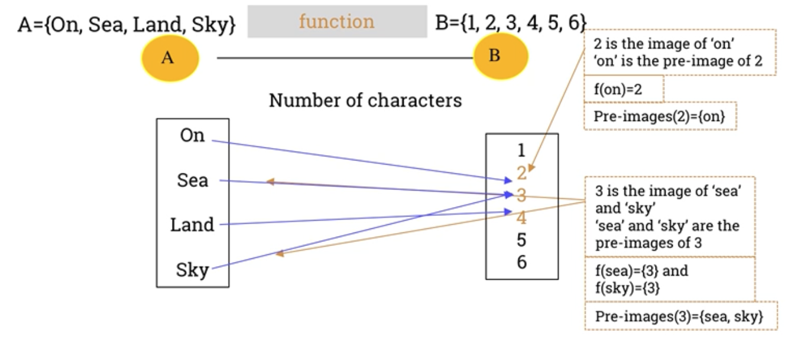
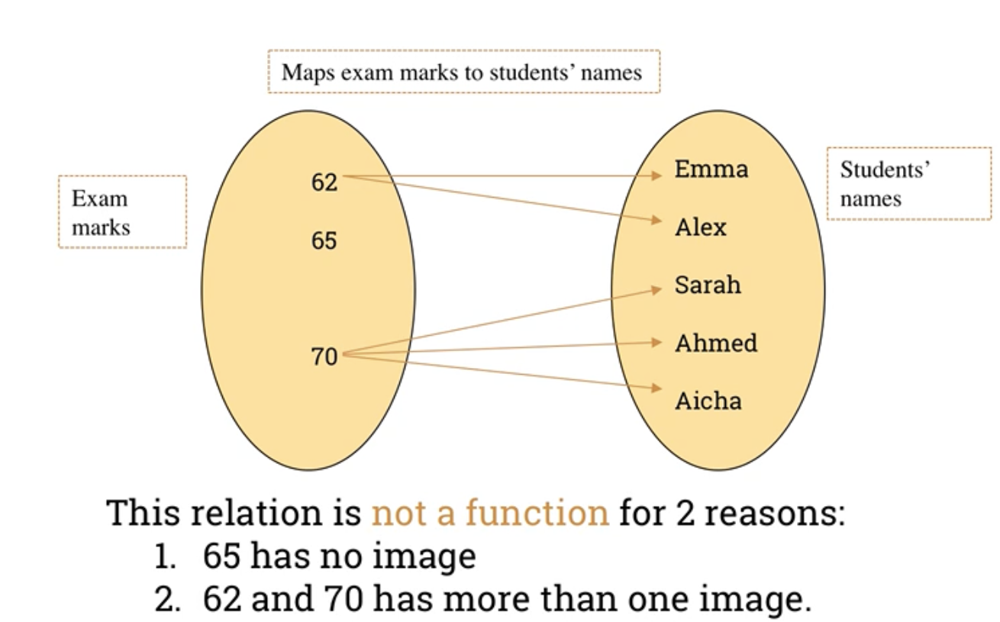

### Topic 2 A. Function

---

#### `The definition of a function`

  
Introduction

  
A function is a relation that assigns exactly one output to each input from a given set.

The concept of a funciton is a central to computer programming.

Most of what a programmer writes consists of "functions" that do parts of the work of the program.

 

  
Definition of a function 1

  

This function takes an element of the set 1 and maps it to an element of the set 2

 

  
Definition of a function 2

  
`Definition`: A function `f` from a set `A` to a set `B` is an assignement of exactly one element of `B` to each element of `A`.

If f is a fucntion from A to B we write:
    
    `f: A -> B`

This can be read as `f maps A to B`

The expression

`x ∈ A: x ↦ f(x) = y where y ∈ B`

is read as: "For each element x in set A , x is mapped to f(x) = y, where y is in set B"

Breakdown:

- x ∈ A: "x is an element of set A" (the domain)
- x → f(x): "x is mapped to f(x)"
- f(x) = y: "the output of the function f at x is y"
- y ∈ B: "y belongs to set B" (the codomain)

 

  
Terminology

  
Given a function: `f: A -> B` 

`x ∈ A -> f(x) = y ∈ B`

A is the set of inputs and is called the domain of f. We write $D_f$ = A .
B is the set containing the outputs and is called the co-domain of f. We 
write co-$D_f$ = B.

The set of outputs is called the range of f and it is written as $R_f$.

y is called the image of x, whereas x is called the pre-image of y.
We write `f(x) = y`

 

  
Domain, co-domain and range

   
  

 

Domain: $D_f$ = A = {on, sea, land, sky}

Co-domain: Co-$D_f$ = B = {1,2,3,4,5,6}

Range: $R_f$ = {2,3,4}

 

  
Introduction

  
A function is a relation that assigns exactly one output to each input from a given set.

The concept of a funciton is a central to computer programming.

Most of what a programmer writes consists of "functions" that do parts of the work of the program.

 

  
Images and pre-images

   
  

 

  
Example: This relation is not a function

   
  

 

  
Example: This relation is a function

   
  

 

  
Exercise 1

   
  
Given the following function: f:  Z -> Z with f(x) = |x|

🔍 Step-by-step explanation:

1. Notation:

- f is a function.
- Z is the set of all integers:

        Z = {...,−3,−2,−1,0,1,2,3,...}

- So f : Z → Z means:

    - The domain is Z (you can plug in any integer) 
    - The co-domain is also Z (outputs are expected to be integers)

    2. Function rule:

    f(x)=∣x∣

This is the absolute value function, which means:

-   If x ≥ 0, then f(x) = x
- If  x < 0, then f(x) = −x

So for example:
- f(3) = ∣3∣ = 3
- f(−3) = ∣−3∣ = 3
- f(0) = ∣0∣ = 0

`Summary`

- Domain: Z
- Co-domain: Z
- Range (actual output): Z = {0,1,2,3,4...}

 

----

#### `Plotting a function`

 

  
Linear function

  
  f(x) = mx + b

  - A `linear function `is a function whose graph is a straight line
  - m: Slope (rate of change)
  - b: Y-intercept (ehere the line crosses the y-axis)

Example: f(x) = 2x + 1

This is a straight line with:

- Slope (m) = 2

- Y-intercept (b) = 1

 