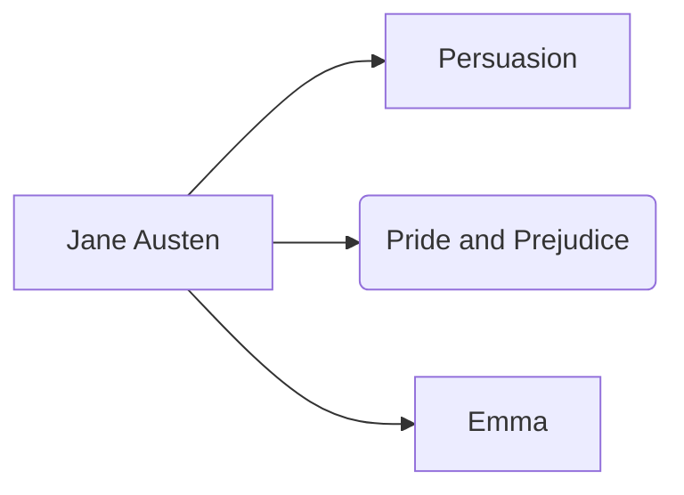
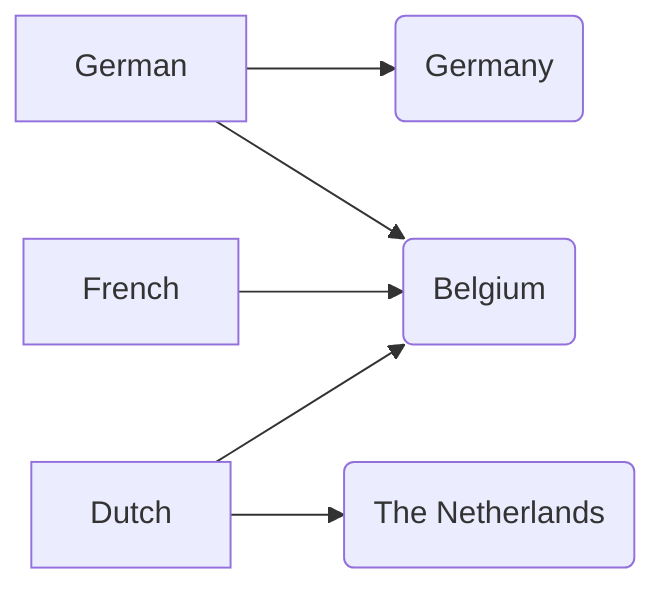

# 1. Introducing Inner Joins

## 1.1 The ins and outs of INNER JOIN

- `key` - field tha uniquely identifies each record.
- `INNER JOIN` looks for records in both tables which match on a given field.


The leadership Database schema


---

<h6>Our first INNER JOIN</h6>

```sql
-- INNER JOIN of presidents and prime-ministers, joining on country

SELECT prime_ministers.country, prime_ministers.continent, prime_minister, president
FROM prime_ministers
INNER JOIN presidents
ON prime_ministers.country = presidents.country
```

`NOTE` the `table.colum_name` must be used when selecting columns that exist in both tables to avoid an SQL error.

| country  | continent |  prime_minister  |        president        |
| :------: | :-------: | :--------------: | :---------------------: |
|  Egypt   |  Africa   | Mostafa Madbouly |  Abdel Fattah el-Sisi   |
|  Egypt   |  Europe   |  António Costa   | Marcelo Rebelo de Sousa |
| Portugal |   Asia    |  Shehbaz Sharif  |     Ram Nath Kovind     |

---

<h6>Aliasing tables</h6>

```sql
-- INNER JOIN of presidents and prime-ministers, joining on country

SELECT p1.country, p1.continent, prime_minister, president
FROM prime_ministers AS p1
INNER JOIN presidents AS p2
ON p1.country = p2.country
```

| country  | continent |  prime_minister  |        president        |
| :------: | :-------: | :--------------: | :---------------------: |
|  Egypt   |  Africa   | Mostafa Madbouly |  Abdel Fattah el-Sisi   |
|  Egypt   |  Europe   |  António Costa   | Marcelo Rebelo de Sousa |
| Portugal |   Asia    |  Shehbaz Sharif  |     Ram Nath Kovind     |

---

<h6>Using USING</h6>

```sql
-- INNER JOIN of presidents and prime-ministers, joining on country

SELECT p1.country, p1.continent, prime_minister, president
FROM prime_ministers AS p1
INNER JOIN presidents AS p2
USING(country)
```

| country  | continent |  prime_minister  |        president        |
| :------: | :-------: | :--------------: | :---------------------: |
|  Egypt   |  Africa   | Mostafa Madbouly |  Abdel Fattah el-Sisi   |
|  Egypt   |  Europe   |  António Costa   | Marcelo Rebelo de Sousa |
| Portugal |   Asia    |  Shehbaz Sharif  |     Ram Nath Kovind     |

# 1.2 Defining relationships

<h6>One-to-many relationships</h6>



---

<h6>One-to-one relationships</h6>


---

<h6>Many-to-many relationships</h6>


