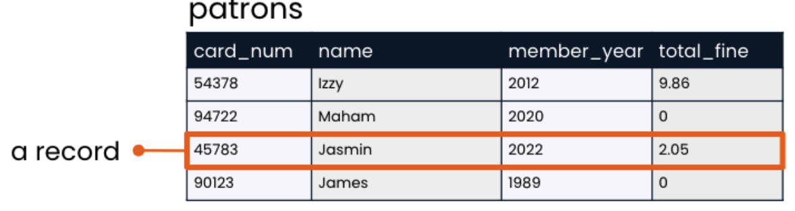
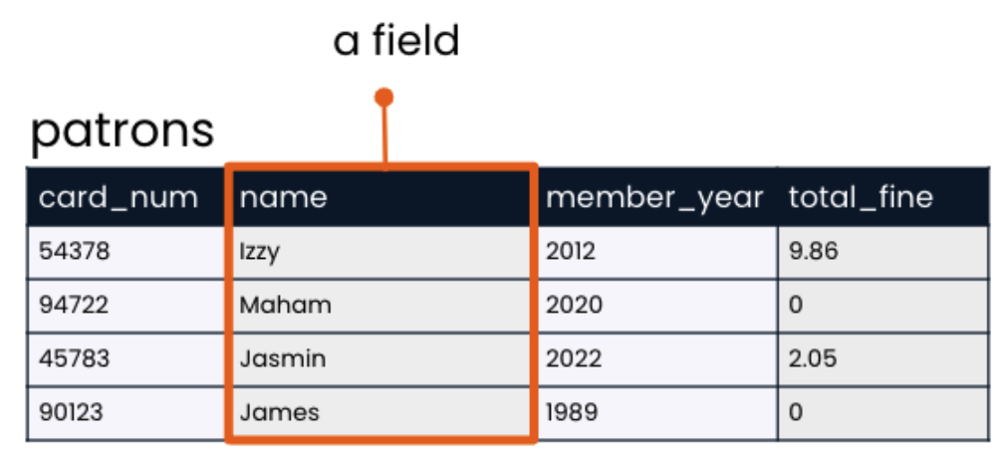

# 1. Relational databases

## 1.1 Databases

Relational databes - defines relationships between tables of data inside the database.

## 1.2 Tables

Table rows and columns are reffered to as `records` and `fields`.
Fields ar set at database creation. There is no limit to the number of records.

<h4>Good table manners</h4>

Table names should...

- be lowercase
- have no spaces-use underscores insteaad.
- refer to a collective group or be plural.

<h4>Records</h4>

A record is a row that holds data on on individual observation.

<h4>Fields</h4>

A field is a column that holds one piece of information aboout all records.

Field names should...

- be lowercase
- have no spaces
- be singular
- be different from other field names
- be different from the table name

<h4>Unique identifiers</h4>

- Unique identifiers are used to identify records in a table.
- They are unique and often numbers

