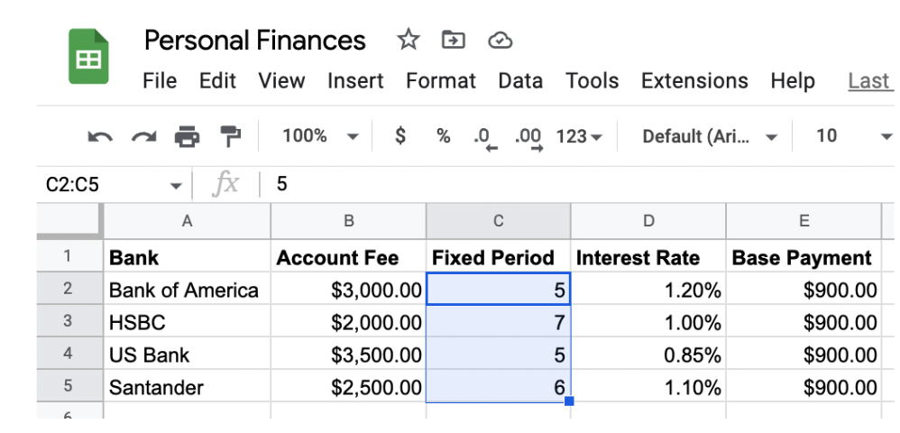
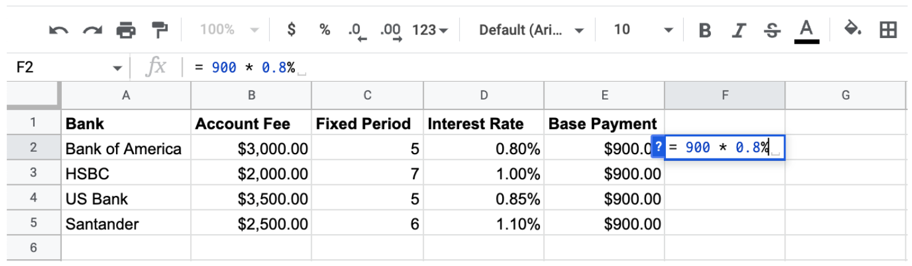
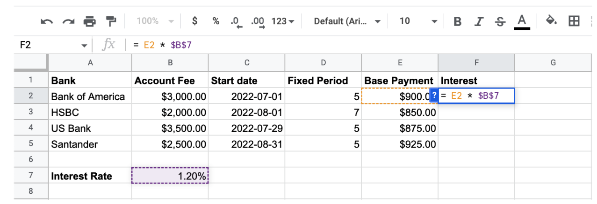

# 1. Cells and Formulas

## 1.1 Navigating Spreadsheets

Importing data

- Can support many different filr types, including `.csv`, `.txt`, `.tsv`, `.xlsx`.
- Spreadsheets store `tabular data`
- Data is stored in individual `cells`
- Cells can contain dat or perform calculations

Cell addresses

- Cells can be uniquely identified by a column (letters) and row label (numbers)
- `Cell addresses` combine the column and row label.

Cell ranges
. A `cell range` defines a rectangular group of cells.
. Example: Column `C` between `2` and `5` => `C2:c5`

## 1.2 Cell mathematics

Formulas

- Calculate results from other values
- Support common arithmetic operations, including: `+`, `-`, `*`, and `/`.
- Allow interested stakeholders to see how values were calculated.

Calculating percentages

## 1.3 Data Types and formatting

Spreadsheet data types

- Cell data types are automatically detected, but can also be manually assigned.
- Data type determines:
  - What operations can be performed on the cell value
  - How the value be displayed

# 2. Cell References

Cell references point to cells and retrieve their values

Circular references - a cell reference that directly or indirectly references itself.

## 2.1 Calculations with cell references

## 2.2 Absolute references

Relative references - change when copied
Absolute references - don't change when copied

Absolute references: fixing rows

- `Partial absolute references` only change when copied in one direction
