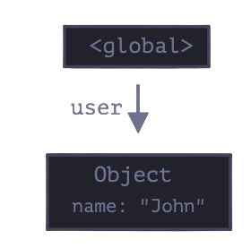

## 4.3.1 Reachability

Simply put, "reachable" values are those that are accessible or usable somehow.

1. There's base set of inherently reachable valuesm that cannot be deleted for obvious reasons.
   For instance:

- The current executing function, its local variables and parametres
- Other functions on the current chain of nested calls, their local varialbes and parameters.
- Global varialbes.

2. Any other value is considered reachable if it's reacahble from a root by a reference or by a chain of reference.

There's a background process in the JS engine that is called `garbage collector`.
It monitors all obkects and removes those that have become unreachable.

## 4.3.2 A simple example

```js
// user has a reference to the object
let user = {
  name: "John",
};
```



Here thearrow depicts an object reference. The global variable `"user"` references the object `{name" "John"}`.

If the value of `user` is overwritten, the reference is lost:

```js
user = null;
```


Now John becomes unreachable. There's no way to access it, no reference to it.
Garbage collector will junk the data and free the memory.

## 4.3.3 Two references

Now let's imagine we copied that reference from `user` to `admin`

```js
// user has a reference to the object
let user = {
  name: "John",
};

let admin = user;
```


Now if we do the same:

```js
user = null;
```

...Then the object is still reachable via `admin` global vatiable, so it must stay in memory. If we overwritte `admin` too, then it can be removed.

## 4.3.4 Interlinked objects

No a more complex example. The family:

```js
function marry(man, woman) {
  woman.husband = man;
  man.wife = woman;

  return {
    father: man,
    mother: woman,
  };
}

let family = marry(
  {
    name: "John",
  },
  {
    name: "Ann",
  }
);
```

Function `marty` "marries" two objects by giving them references to each other and returns a new object that contains them both.

The resulting memory structure:


As of now, all objects are reachable.

Now let's remove two references:

```js
delete family.father;
delete family.mother.husband;
```


It's not enough to delete only one of these two references, because all objects would still be reachable.
But if we delete both, then we can see that John has no incomming reference any more:


Outgoing references do not matter. Only incoming ones can make an object reachable. So John is now unreachable and will be removed from the memory with all its data that also beecame unaccessible.
