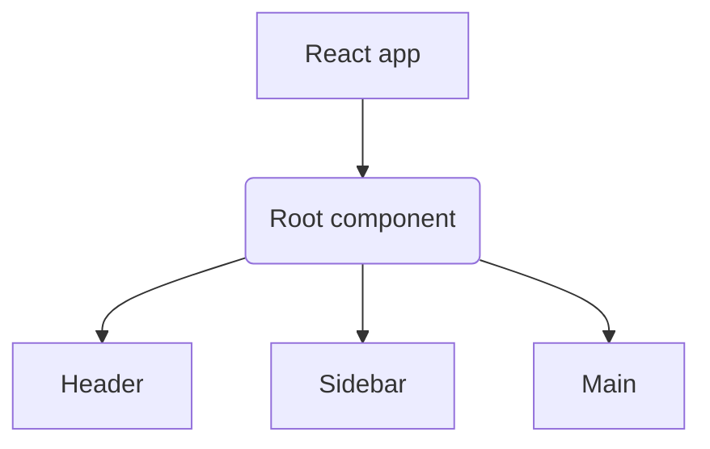
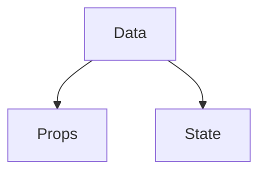
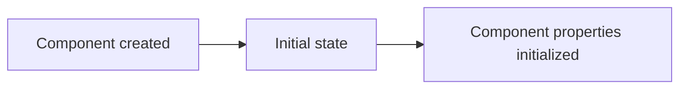
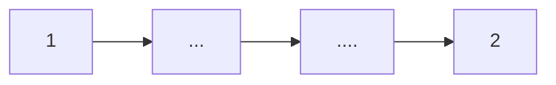
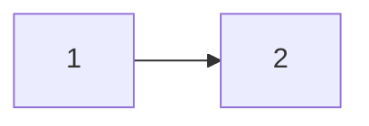
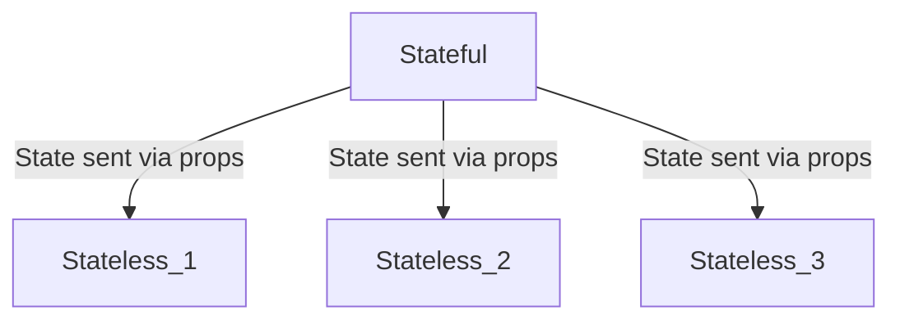

# Week 1

## 1. Course Introduction

### 1.1 React Basics

Set up

1. run `npm init react-app example`, where 'example' is the actual name of your app.
2. `cd example`
3. `npm start`

## 2. React components and where they live

### 2.1 Why react

### 2.2 React.js overview

React.js - a js library for single-page applications.
Component-based architecture - build software based on resuable components of code.
Components - stand alone parts of a UI.

### 2.3 Introduction to functional components

React provides two types of components:

```js
// Functional components
function Welcome() {
  return <h1>Hello</h1>;
}

// Class components
class Welcome extends React.Component {
  render() {
    return <h1>Hello</h1>;
  }
}
```

Render syntax

```js
<ComponentName />
```



JSX - Synta extensio for JS

Example of creating a Rect component

1. Create file `Heading.js`
   Capitalizing a component name helps to distinguish JSX elements from HTML elements.
2. Inside the `Heading.js`, create the following:

```js
function Heading() {
  let title = "This is some heading text";
  return <h1>{title}</h1>;
}
```

Transpiling - interpreting a programming language and translating it ti a specifix target language.

### 2.4 Creating React Components

1. Remove all code inside the function `App()` in the `App.js` file
2. Create the `Header()` function

```js
function Header() {
  return <h1>Hello, World</h1>;
}
```

3. Type the `Header` funcion inside the `App` function

```js
import logo from "./logo.svg";
import "./App.css";

function Header() {
  return <h1>Hello, World</h1>;
}

function App() {
  return <Header />;
}

export default App;
```

### 2.5 The React project structure

- `node_modules` folder - repository for all the modules in your React app.
  It's automatically added when an npm package is installed.
- `public` folder - contains the assets that will be displayed in the app.
- `src` folder - Contains all the essential components files required to ensure that a React app functions.

Customizing the project

Type the following in the terminal

```js
npm init react-app customizing-example
```

Inspect the `src` folder of the starter app

```
src /
  App.js;
  App.test.js;
  index.css;
  index.js;
  logo.svg;
  reportWebVitals.js;
  setupTests.js;
```

Then simply add a components folder to it

```
src/
  components/
  App.js
  App.test.js
  index.css
  index.js
  logo.svg
  reportWebVitals.js
  setupTests.js
```

Add components is the components folder

```
src/
    components/
        Nav.js
        Promo.js
        Intro1.js
        Intro2.js
        Intro3.js
        Footer.js
    App.js
    App.test.js
    index.css
    index.js
    logo.svg
    reportWebVitals.js
    setupTests.js
```

`Building Components`

<details>
  <summary>Building the components</summary>

```js
// The content in the Nav.js file
function Nav() {
  return (
    <nav className="main-nav">
      <ul>
        <li>Home</li>
        <li>Articles</li>
        <li>About</li>
        <li>Contact</li>
      </ul>
    </nav>
  );
}

export default Nav;
```

```js
// The content in the Promo.js file
function Promo() {
  return (
    <div className="promo-section">
      <div>
        <h1>Don't miss this deal!</h1>
      </div>
      <div>
        <h2>
          Subscribe to my newsletter and get all the shop items at 50% off!
        </h2>
      </div>
    </div>
  );
}

export default Promo;
```

```js
// The content in the Intro1.js file
function Intro1() {
  return (
    <div className="blog-post-intro">
      <h2>I've become a React developer!</h2>
      <div>
        <p>
          I've completed the React Basics course and I'm happy to announce that
          I'm now a Junior React Developer!
        </p>
        <p className="link">Read more...</p>
      </div>
    </div>
  );
}

export default Intro1;
```

```js
// The content in the Intro2.js file
function Intro2() {
  return (
    <div className="blog-post-intro">
      <h2>Why I love front-end web development</h2>
      <div>
        <p>
          In this blog post, I'll list 10 reasons why I love to work as a
          front-end developer.
        </p>
        <p className="link">Read more...</p>
      </div>
    </div>
  );
}

export default Intro2;
```

```js
// The content in the Intro3.js file
function Intro3() {
  return (
    <div className="blog-post-intro">
      <h2>What's the best way to style your React apps?</h2>
      <div>
        <p>
          There are so many options to choose from. Here's a high-level overview
          of the popular ones.
        </p>
        <p className="link">Read more...</p>
      </div>
    </div>
  );
}

export default Intro3;
```

```js
// The contetn in the Footer.js
function Footer() {
  return (
    <div className="copyright">
      <p>Made with love by Myself</p>
    </div>
  );
}

export default Footer;
```

</details>

Place the components in the `App.js `file

```js
import "./App.css";
import Nav from "./components/Nav";
import Intro1 from "./components/Intro1";
import Intro2 from "./components/Intro2";
import Intro3 from "./components/Intro3";
import Footer from "./components/Footer";
import React from "react";
import ReactDOM from "react-dom";
import Promo from "./components/Promo";

function App() {
  return (
    <React.Fragment>
      <Nav />
      <Promo />
      <Intro1 />
      <Intro2 />
      <Intro3 />
      <Footer />
    </React.Fragment>
  );
}

export default App;
```

### 2.6 Importing components

Modules - Stand-alone units of code that you can re-use again and again

```
components/
  Header.js
  Main.js
  Footer.js
```

Modules:

```js
// import statement
import { Header } from "Header.js";

// export statement
export default Header;
```

Exports - stand alone units of code that you can re-use again and again.

```js
// App.js
// Default exports
export default App;

// Named exports
export { App };
```

- Component - Small piece of functionality
- Module - Series of components

## 3. Component Use and Styling

### 3.1 Principles of components

```js
// Javascript function

// Function declaration with parameters
function addNumbers(num1, num2) {
  console.log(num1 * num2);
}

// Values passed as arguments
addNumbers(2, 4);

// Props - passing data between components

import React from "react";

export function App(props) {
  return <h1>{props.title}</h1>;
}
```

### 3.2 Using props in components

```js
// In the App.js
import "./App.css";
import React from "react";
import Heeader from "./components/Header";
import Sidebar from "./components/Sidebar";
import Main from "./components/Main";

function App() {
  return (
    <React.Fragment>
      <Heeader name="Anna" color="purple" />
      <Main greet="Howdy" />
      <Sidebar greet="Hi" />
    </React.Fragment>
  );
}

export default App;

// In the components/Header.js
import React from "react";

function Heeader(props) {
  console.log(props);
  return (
    <h1>
      Hello from {props.name} {props.color}
    </h1>
  );
}

export default Heeader;

// In the components/Main.js
import React from "react";

function Main(props) {
  return <h1>{props.greet} from main</h1>;
}

export default Main;

// In the components/sidebar.js
import React from "react";

function Sidebar(props) {
  return <h1>{props.greet} from sidebar</h1>;
}

export default Sidebar;
```

### 3.3 Introducing JSX

JSX - Write HTML directly inside JS code

```js
import React from "react";
import "../index.css";

function Heeader(props) {
  console.log(props);
  return (
    <h1 className="header">
      Hello from {props.name} {props.color}
    </h1>
  );
}

export default Heeader;
```

```css
.header {
  background-color: lightblue;
}
```

A second way to add styles to components

```js
import React from "react";
import "../index.css";

const header = {
  backgroundColor: "lightblue",
};

function Heeader(props) {
  console.log(props);
  return (
    <h1 style={header}>
      Hello from {props.name} {props.color}
    </h1>
  );
}

export default Heeader;
```

### 3.4 Embedded JSX expressions

Embedded expressions - allow JS values to be inserted into HTML of React elements

```js
// Function
function formatName(firstName, surname) {
  return firstName + " " + surname;
}

// Embedded function outputs
const result = <p>{formatName("Jane", "Wilson")}</p>;

// HTML
<p>Jane Wilson</p>;
```

### 3.5 Embedding in attributes

```js
import "./App.css";
import React from "react";
import image from "./logo192.png";

function Image(props) {
  const img = ;
  return img;
}

function App() {
  return (
    <div>
      <h1>Hello</h1>
      <Image />
    </div>
  );
}

export default App;
```

# Week 2

## 1. Dynamic events and how to handle them

### 1.1 Types of events

The click handling attribute for HTML is `onclick` and for JSX is `onClick`

Event Groups

- Clipboard events
- Composition events
- Keyboard events
- Mouse events
  ...... and more!

### 1.2 Common event handling

```js
// In the App.js
import React from "react";
import Btn from "./Btn";

function App() {
  return <Btn />;
}

export default App;

// In the Btn.js
const clickHandler = () => {
  console.log("Clicked");
};

function Btn() {
  return <button onClick={clickHandler}>Click me, if you dare!</button>;
}

export default Btn;

```

### 1.3 Syntax for handlers

`Event` - Click a button
`Event Handler` - onClick
`Action` - Open menu

```html
<!-- In html -->
<button id="btn" onclick="clickHandler()">Click me</button>
```

```js
// In React
<button onClick={clickHandler}>Click me</button>
```

### 1.4 User events

## 2. Data and Events

### 2.1 Parent-child data flow

```js
// Promo component => parent component
const data = {
  heading: '99% off all items!'
  callToAction: 'Everything must go'
}

function Promo() {
  return (
    <div>
      <PromoHeading
      heading={data.heading}
      callToAction={data.callToAction}
      />
    </div>
  );
}

export default Promo;

// PromoHeading component => child component
function PromoHeading(props) {
  return (
    <h1>{props.heading}</h1>;
    <h2>{props.callToAction}</h2>;
  )
}

export default PromoHeading;
```

### 2.2 Children and data

Parent component =======> Data flow ===========> Child component



Props data is data outside the component and cannot mutate.
State data is data inside the component and the compoent can control and mutate the data.

### 2.3 What are hooks?

Hooks - functions that let you hook into React state and lifecycle features from components.

To use hooks follows the steps:

1. Import the `useState`

```js
import React, { useState } from "react";
```

2. Declare a state variable

```js
const [state, setState] = useState(initialState);

// Provide any name using array destructuring
// Now there is a state variable `showMenu` and inital value of `showMenu` to false.
const [showMenu, setShowMenu] = useState(false);

// Witout array destructuring
let menuState = useState(false);
let showMenu = menuState[0]; // Access first item in array
let setShowMenu = menuState[1]; // Access second item in array
```

### 2.4 What is state?

State - Data in a component that determines behaviour.



```js
// Stateless Component
function App() {
  // Renders text directly
  return <h1>A completely stateless component!</h1>;
}

// Stateful component
functio App() {
  const [word, setWord] = React.useState('Hello')
  console.log(React.useState('Hello'))
  // Output: 0: 'hello' 1: f()

  return (
    <div>
    // Renders text contained in a variable
      <h1>A state value: {word}</h1>
    </div>
  )
}

// ES6 array destructuring

let fruits = ['apple', 'pear', 'plum']

const fruits = ['apple', 'pear', 'plum'];
const [fruit1, fruit2, fruit3] = fruits;
```

### 2.5 Observe state

<h6>useState Hook</h6>

```js
const [data, setDate] = React.useState(new Date());
// date - used to access date state
// setDate - used to update state
```

<details>
  <summary>Example</summary>

```js
// In the App.js
import "./App.css";
import React from "react";
import Heading from "./Heading";

function App() {
  const [word, setWord] = React.useState("Eat");

  function handleClick() {
    setWord("Drink");
  }

  return (
    <div className="App">
      <Heading message={`${word} at Little Lemon`} />
      <button onClick={handleClick}>Click here</button>
    </div>
  );
}

export default App;

// In the Heading.js
function Heading(props) {
  return <h1>{props.message}</h1>;
}

export default Heading;

```

</details>

### 2.6 Managing state

Prop drilling - is a commonly used term to describe having to pass props in several layers of components.
Global state - whenever there are states that have to be used in varuious places in the app, that needs to be a global state.

### 2.7 React state management

Passing Props



Context API



`Context provider` - Component that stores the state
`Context Consumer` - Component that will use the state

### 2.8 Stateful vs. stateless

Stateless - State needed to work
Stateful - State must be maintained to work



# Week 3

## 1. Linking and Routing

### 1.1 Basic Types of navigation

Website navigation - Browse through various pages or links from a single component.
`react-router-dom` - is a popular library in the React ecosystem that provides a declarative way to navigate and handdle routing within a single page application (SPA).

### 1.2 The navbar

React router - A library that gives you more control over the routing of components.

### 1.3 Conditional rendering

```js
function IsItSummerYet() {
  const summer = true;

  return(
    {summer
    ? <h1>Let's go to the beach</h1>
    : <h1>Let's watch</h1>
    }
  )
}

// If the condition is true return "Let's go to the beach"
// Else return "Let's watch"
// In this case it retruns "Let's go to the beach"
```

## 2. Using Assets in React

### 2.1 What is an asset and where does it live?

```js
// 1. Import an asset
import cat from "./assets/images/cat.jpg";

// 2. use an asset (name reference)
function showAnimal() {
  return (
    <div>
      
    </div>
  );
}

export default showAnimal;
```

### 2.2 Using embedded assets
