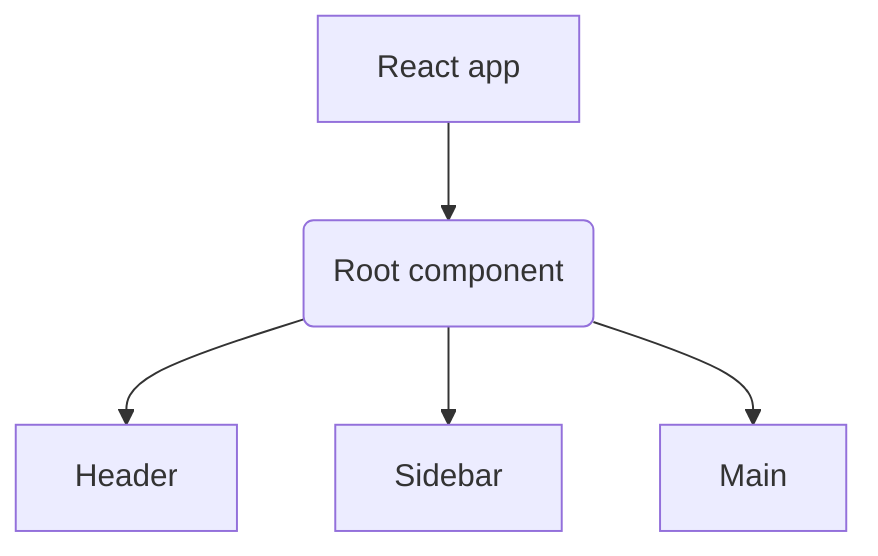

# Week 1

## 1. Course Introduction

### 1.1 React Basics

Set up

1. run `npm init react-app example`, where 'example' is the actual name of your app.
2. `cd example`
3. `npm start`

## 2. React components and where they live

### 2.1 Why react

### 2.2 React.js overview

React.js - a js library for single-page applications.
Component-based architecture - build software based on resuable components of code.
Components - stand alone parts of a UI.

### 2.3 Introduction to functional components

React provides two types of components:

```js
// Functional components
function Welcome() {
  return <h1>Hello</h1>;
}

// Class components
class Welcome extends React.Component {
  render() {
    return <h1>Hello</h1>;
  }
}
```

Render syntax

```js
<ComponentName />
```



JSX - Synta extensio for JS

Example of creating a Rect component

1. Create file `Heading.js`
   Capitalizing a component name helps to distinguish JSX elements from HTML elements.
2. Inside the `Heading.js`, create the following:

```js
function Heading() {
  let title = "This is some heading text";
  return <h1>{title}</h1>;
}
```

Transpiling - interpreting a programming language and translating it ti a specifix target language.

### 2.4 Creating React Components

1. Remove all code inside the function `App()` in the `App.js` file
2. Create the `Header()` function

```js
function Header() {
  return <h1>Hello, World</h1>;
}
```

3. Type the `Header` funcion inside the `App` function

```js
import logo from "./logo.svg";
import "./App.css";

function Header() {
  return <h1>Hello, World</h1>;
}

function App() {
  return <Header />;
}

export default App;
```

### 2.5 The React project structure

- `node_modules` folder - repository for all the modules in your React app.
  It's automatically added when an npm package is installed.
- `public` folder - contains the assets that will be displayed in the app.
- `src` folder - Contains all the essential components files required to ensure that a React app functions.

Customizing the project

Type the following in the terminal

```js
npm init react-app customizing-example
```

Inspect the `src` folder of the starter app

```
src /
  App.js;
  App.test.js;
  index.css;
  index.js;
  logo.svg;
  reportWebVitals.js;
  setupTests.js;
```

Then simply add a components folder to it

```
src/
  components/
  App.js
  App.test.js
  index.css
  index.js
  logo.svg
  reportWebVitals.js
  setupTests.js
```

Add components is the components folder

```
src/
    components/
        Nav.js
        Promo.js
        Intro1.js
        Intro2.js
        Intro3.js
        Footer.js
    App.js
    App.test.js
    index.css
    index.js
    logo.svg
    reportWebVitals.js
    setupTests.js
```

`Building Components`

<details>
  <summary>Building the components</summary>

```js
// The content in the Nav.js file
function Nav() {
  return (
    <nav className="main-nav">
      <ul>
        <li>Home</li>
        <li>Articles</li>
        <li>About</li>
        <li>Contact</li>
      </ul>
    </nav>
  );
}

export default Nav;
```

```js
// The content in the Promo.js file
function Promo() {
  return (
    <div className="promo-section">
      <div>
        <h1>Don't miss this deal!</h1>
      </div>
      <div>
        <h2>
          Subscribe to my newsletter and get all the shop items at 50% off!
        </h2>
      </div>
    </div>
  );
}

export default Promo;
```

```js
// The content in the Intro1.js file
function Intro1() {
  return (
    <div className="blog-post-intro">
      <h2>I've become a React developer!</h2>
      <div>
        <p>
          I've completed the React Basics course and I'm happy to announce that
          I'm now a Junior React Developer!
        </p>
        <p className="link">Read more...</p>
      </div>
    </div>
  );
}

export default Intro1;
```

```js
// The content in the Intro2.js file
function Intro2() {
  return (
    <div className="blog-post-intro">
      <h2>Why I love front-end web development</h2>
      <div>
        <p>
          In this blog post, I'll list 10 reasons why I love to work as a
          front-end developer.
        </p>
        <p className="link">Read more...</p>
      </div>
    </div>
  );
}

export default Intro2;
```

```js
// The content in the Intro3.js file
function Intro3() {
  return (
    <div className="blog-post-intro">
      <h2>What's the best way to style your React apps?</h2>
      <div>
        <p>
          There are so many options to choose from. Here's a high-level overview
          of the popular ones.
        </p>
        <p className="link">Read more...</p>
      </div>
    </div>
  );
}

export default Intro3;
```

```js
// The contetn in the Footer.js
function Footer() {
  return (
    <div className="copyright">
      <p>Made with love by Myself</p>
    </div>
  );
}

export default Footer;
```

</details>

Place the components in the `App.js `file

```js
import "./App.css";
import Nav from "./components/Nav";
import Intro1 from "./components/Intro1";
import Intro2 from "./components/Intro2";
import Intro3 from "./components/Intro3";
import Footer from "./components/Footer";
import React from "react";
import ReactDOM from "react-dom";
import Promo from "./components/Promo";

function App() {
  return (
    <React.Fragment>
      <Nav />
      <Promo />
      <Intro1 />
      <Intro2 />
      <Intro3 />
      <Footer />
    </React.Fragment>
  );
}

export default App;
```

### 2.6 Importing components

Modules - Stand-alone units of code that you can re-use again and again

```
components/
  Header.js
  Main.js
  Footer.js
```

Modules:

```js
// import statement
import { Header } from "Header.js";

// export statement
export default Header;
```

Exports - stand alone units of code that you can re-use again and again.

```js
// App.js
// Default exports
export default App;

// Named exports
export { App };
```

- Component - Small piece of functionality
- Module - Series of components

## 3. Component Use and Styling

### 3.1 Principles of components

```js
// Javascript function

// Function declaration with parameters
function addNumbers(num1, num2) {
  console.log(num1 * num2);
}

// Values passed as arguments
addNumbers(2, 4);

// Props - passing data from component to another

import React from "react";

export function App(props) {
  return <h1>{props.title}</h1>;
}
```
