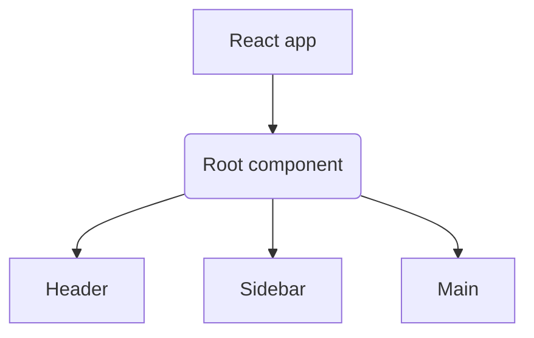

# Week 1

## 1. Course Introduction

### 1.1 React Basics

Set up

1. run `npm init react-app example`, where 'example' is the actual name of your app.
2. `cd example`
3. `npm start`

## 2. React components and where they live

### 2.1 Why react

### 2.2 React.js overview

React.js - a js library for single-page applications.
Component-based architecture - build software based on resuable components of code.
Components - stand alone parts of a UI.

### 2.3 Introduction to functional components

React provides two types of components:

```js
// Functional components
function Welcome() {
  return <h1>Hello</h1>;
}

// Class components
class Welcome extends React.Component {
  render() {
    return <h1>Hello</h1>;
  }
}
```

Render syntax

```js
<ComponentName />
```



JSX - Synta extensio for JS

Example of creating a Rect component

1. Create file `Heading.js`
   Capitalizing a component name helps to distinguish JSX elements from HTML elements.
2. Inside the `Heading.js`, create the following:

```js
function Heading() {
  let title = "This is some heading text";
  return <h1>{title}</h1>;
}
```

Transpiling - interpreting a programming language and translating it ti a specifix target language.
