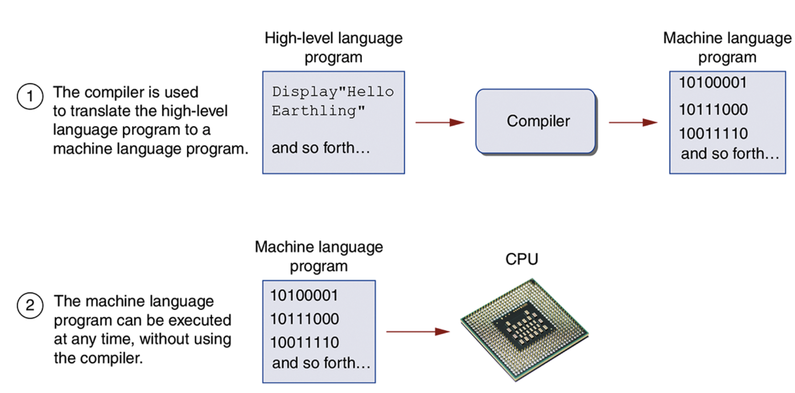
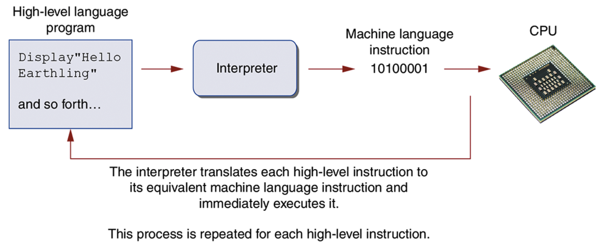

## 1.1 Introduction

A `program` is a set of instructions that a computer foloows to perfoem a task.
Programs are commonly referred to as `software`.

## 1.2 Hardware

The term `hardware` refers to all of the physical devices, or `components` that a computer is made of.

- The central processing unit (CPU) - The part of a computer that executes programs
- Main memory - a computers memory that stores programs while they are running, as well as the data the data the programs are working with.
  Main memory is commonly known as `random-access memory` or `RAM`.
- Secondary storage devices - A type of data that can hold memory for long periods of time, even when there is no power to the computer.
- Input devices - Any data that the computer collects from people or other devices.
- Output devices - Data the computer produces for people or other devices.

## 1.3 How computers store data

All data that is stored in a computer is converted to dequences of 0s and 1s.
A computers' memory is divided into tiny storage locations known as `bytes`. One byte is only enough memory to store a letter of the alphabet or a small number. Each byte is divided into eight smaller locations known as bits.

---

<h6>Storing Numbers</h6>

A bit cvan be used in a very limited way to represent numbers. Depending on whether the bit is turned on or off, it can represent one of two fifferent values.

Two bytes used for large number

---

<h6>Storing Characters</h6>

Any piece of data that is stored in a computers' memory must be stored as a binary number. That includes characters, such as letters and punctuation marks. When a character is stored in memory, it is first converted to a numeric code.

---

<h6>Advanced Number Storage</h6>

Negative numbers are encoded using a technique known as `two's complement`, and real numbers are encoded in `floating-point notation`. These two encoding schemes are used to convert negative numbers and real numbers to binary format.

---

<h6>Other types of data</h6>

Computers are often referred to as digital devices. The term `digital` can be used to describe anything that uses binary numbers. Digital data is data that is stored in binary, and a `digital device` is any device that works with binary data.

## 1.4 How a Program works

A program is nothing more than a list of instructions that cause the CPU to perform operations.
CPU's only understand instructions that are written in `machine language` and machine language instructions are always written in binary.
The entire set of instructions that a CPU can execute is known as the CPU's `instruction set`.

When a CPU executes the instructions in a program, it is engaged in a process that us known as the `fetch-decode-execute cycle`.

1. `Fetch` - The first step of the cycle is to fetch, or read the next instruction from memory into the CPU.
2. `Decode` - In this step the CPU decodes the instruction that was just fetched from memory, to determine which operation it should perform.
3. `Execute` - The last step in the cylcle is to execute or perform the operation.

---

<h6>From Macine Language to Assembly Language</h6>

Although a computer's CPU only understands machine language, it is impractical for people to write programs in machine language. For this reason `assembly language` was created in the early days of computing as an alternative to machine language. Instead of using binary numbers for instructions, assembly language uses short words that are known as `mnemonics`.
Assenbly language programs cannot be executed by the CPu, however. The CPU only understands machine language, so a special program known as an `assenbler` is used to translate an assembly language program to machine language program.

---

<h6>High-Level Languages</h6>

Because assembly language is so close in nature to machine language, it is referred to as a `low-level language`.
In the 1950s, a new generation of programming languages known as `high-level languages` began to appear. A high-level language allows you to create powerful and complex programs without knowing how the CPu works, and without writting large numbers of low-level instructions.
Each high-level language has its own set of words that the programmer must learn in order to use the language. The words that make up a high-level programming language are known as `key words` or `resered words`.
In addition to key words, programming languages have `operators` that perform various operations on data.
In addition to key words and operators, each language also has its own `syntax`, which is a set of rules that must be strictly followed when writting a program.
The individual instructions that you use to write a program in a high-level programming language are called `statements`.

---

<h6>Compilers and Interpreters</h6>

Once a program has been written in a high-level language, the programmer will use a compiler or an interpreter to make the translation.
A `compiler` is a program that transplates a high-level language program into a separate machine language program.

An `interpreter` is a program that both translates and executes the instructions in a high-level language program.

The statements that a programmer writtes in a high-level language are called `source code` or simply `code`.

---

<h6>Integrated Development Environments</h6>

IDE - stands for `Integrated Development Environments`

## 1.5 Types of Software

Programs generally fall into one of two categories: system software or application software. System software is the set of programs that control or enhance the operation of a computer. Applicatio software makes a computer useful for everydat tasks.

---

<h6>System Software</h6>

The programs that control and manage the basic operations of a computer are generally referred to as `system software`. System software typically includes the following types of programs:

- Operating Systems
- Utility Programs
- Software Development Tools

---

<h6>Application Software</h6>

Programs that make a computer useful for everyday tasks are known as `application swoftware`. These are the programs that people normally spend most of their time running on their computers.
