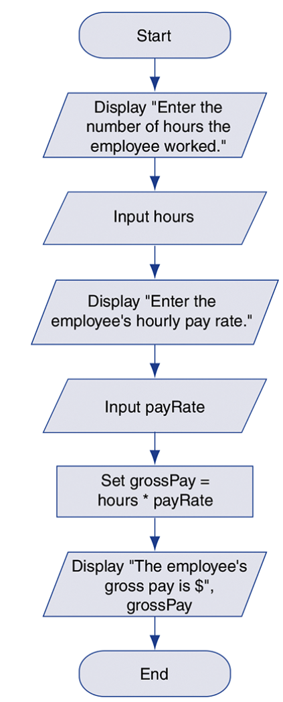

## 2.1 Design a Program

The program development cycle

---

<h6>Designing a Program</h6>

1. Understand the taks that the program is to
   `customer` - the person. group or organization asking you to write a program.
   `software requirement` - A single function that the program must perform in order to satisfy the customer.
2. Determine the steps that must be taken to perform the task
   `algorithm` - A set of well-defined logical steps that must be taken in order to perform a task.

---

<h6>Pseudocode</h6>

`pseudocode` - An informal language that has no syntax rules, and it is not meant to be compiled or executed.

---

<h6>Flowcharts</h6>

`flowchart` - Is a diagram that graphically depicts the steps that take place in a program.

Notice that there are three types of symbols in the flowchart: ovals, parallelograms and rectangles. The ovals, which appear at the top and botoom of the flowchart, are called `terminal symbols`. The `Start terminal` symbol marks the program's starting point and the `End terminal` symbol marks the program's ending point.
Between the terminal symbols are parallelograms, which are used for both `input symbols` and `output symbols`, and rectangles, which ar called `processing symbols`.
