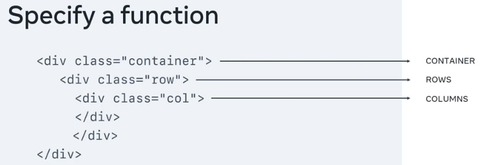

# Week 1 

## How the web works

### How the internet works
The internet is a global network of computers and other devices that are connected to each other using a standardized communication protocol called the Internet Protocol (IP). The inter works by enabling these devices to communicate with each other, share information, and access resources that are stored on other devices connected to the network.

### What is a web server and how does it work?
A web server is a software program that runs on a computer or server and delivers content, such as web pages, to clients that request it via the internet using HTTP (Hypertext Transfer Protocol) protocol. 

### Web hosting
Web hosting is a service that allows individuals and organizations to make their websites accessible on the internet. In other words, it’s the process of renting space on a server to store website files and make them available to others to view online.
There are various types of web hosting services available, including shared hosting, dedicated hosting, cloud hosting and more.

## Core internet technologies

### Introduction to Internet Protocols
Internet protocols are standardized methods for communication between different devices and applications on the internet. They provide a set of procedures for transmitting and receiving data across networks.
There are many different internet protocols that are used for different purposes, but some of the most common ones include: 
1. IP (Internet Protocol) : This is the core protocol of the internet that enables communication between devices by routing data packets to networks.
2. TCP (Transmission Control Protocol): This protocol provides reliable, ordered and error-checked delivery of data between applications running on different devices.
3. HTTP (Hypertext Transfer Protocol): This is the protocol used for transmitting web pages and other resources over the internet.
4. FTP (File Transfer Protocol): This protocol is used for transferring files between computers over the internet.
5. SMTP (Simple Mail Transfer Protocol): This protocol is used for sending and receiving email messages over the internet.
6. DNS (Domain Name System): This protocol is used for translating human-readable domain names (such as www.example.com) into IP addresses that computers can use to locate services on the internet.

### Introduction to HTTP 

#### HTTP Methods

| HTTP Methods        | Description           | 
| ------------- |:-------------:| 
| GET     | The client requeres a resource on the web server | 
| POST      | The client submits data to a resource on the web server    | 
| PUT | The client replaces a resource on th web server     |  
| DELETE | The client deletes a resource on the web server     | 

#### HTTP Request Headers

Commmon headers are: 
```
Host: example.com
User-Agent: Mozilla/5.0 (Macintosh; Intel Mac OS X 10.9; rv:50.0) Gecko/20100101 Firefox/50.0
Accept: */*
Accept-Language: en
Content-type: text/json
```
- The '**_Host_**' header specifies the host of the server and indicates where the resource is requested from.
- The '**_User-Agent_**' header informs the web server of the application that is making the request. It often includes the operating system (Windows, Mac, Linux), version and application vendor.
- The '**_Accept_**' header informs the web server what type of content the client will accept as the response.
- The '**_Accept-Language_**' header indicates the language and optionally the locale that the client prefers.
- The '**_Content-type_**' header indicates the type of content being transmitted in the request body.

#### Frameworks and Libraries
Frameworks are comprehensive tools that provide a structure to build an entry application, while libraries are collections of pre-written code that can be used to perform specific tasks.

#### APIs and Services
API (Application Programming Interface) - Is a service, application or interface offering advanced functionality with simple syntax.
REST (Representational State Transfer) is a set of principles used to build highly efficient APIs.

# Week 2

## Getting started with HTML

## CSS Basics

## Creating a web page

# Week 3

## Intro to UI Framework and Libraries

### Working with libraries

Set up Bootstrap 

1. Open HTML file

```html
<!DOCTYPE html>
<html lang="en">
<head>
     <title>My Website</title>
</head>
  <body></body>
</html>
```

2. Add CSS library to HTML head

```html
<!DOCTYPE html>
<html lang="en">
<head>
     <link rel="stylesheet" href="https://cdn.jsdelivr.net/npm/bootstrap@5.2.3/dist/css/bootstrap.min.css"
  integrity="sha384-rbsA2VBKQhggwzxH7pPCaAqO46MgnOM80zW1RWuH61DGLwZJEdK2Kadq2F9CUG65" crossorigin="anonymous">
   <title>Document</title>
</head>
  <body></body>
</html>
```

3. Add JS library to HTML body

```html
<!DOCTYPE html>
<html lang="en">
<head>
   <meta charset="UTF-8">
   <meta http-equiv="X-UA-Compatible" content="IE=edge">
   <link rel="stylesheet" href="https://cdn.jsdelivr.net/npm/bootstrap@5.2.3/dist/css/bootstrap.min.css"
       integrity="sha384-rbsA2VBKQhggwzxH7pPCaAqO46MgnOM80zW1RWuH61DGLwZJEdK2Kadq2F9CUG65" crossorigin="anonymous">
   <meta name="viewport" content="width=device-width, initial-scale=1.0">
   <title>Document</title>
</head>
<body>

   <script src="https://cdn.jsdelivr.net/npm/bootstrap@5.2.3/dist/js/bootstrap.min.js"  integrity="sha384-cuYeSxntonz0PPNlHhBs68uyIAVpIIOZZ5JqeqvYYIcEL727kskC66kF92t6Xl2V"
       crossorigin="anonymous"></script>
</body>

</html>
```

4. Add button element

```html
!DOCTYPE html>
<html lang="en">
<head>
   <meta charset="UTF-8">
   <meta http-equiv="X-UA-Compatible" content="IE=edge">
   <link rel="stylesheet" href="https://cdn.jsdelivr.net/npm/bootstrap@5.2.3/dist/css/bootstrap.min.css"
       integrity="sha384-rbsA2VBKQhggwzxH7pPCaAqO46MgnOM80zW1RWuH61DGLwZJEdK2Kadq2F9CUG65" crossorigin="anonymous">
   <meta name="viewport" content="width=device-width, initial-scale=1.0">
   <title>Document</title>
</head>
<body>
   <!-- Add button -->
   <button type="button" class="btn btn-primary">Click this button!</button>


   <script src="https://cdn.jsdelivr.net/npm/bootstrap@5.2.3/dist/js/bootstrap.min.js"
       integrity="sha384-cuYeSxntonz0PPNlHhBs68uyIAVpIIOZZ5JqeqvYYIcEL727kskC66kF92t6Xl2V"
       crossorigin="anonymous"></script>
</body>
</html>

```

Package manager is a tool that automatically downloads and installs dependencies.
NPM (Node Package Manager).
Bundler - Is a tool used in web development to bundle together multiple files or modules into a single file that can be loaded by a web browser. (examples Gulp and Webpack)

### Getting Started with Bootstrap

Bootstrap is a collection of pre-written code chunks in CSS and JavaScript.

```html
<html lang="en">
<head>
      <link rel="stylesheet" href="https://cdn.jsdelivr.net/npm/bootstrap@5.2.3/dist/css/bootstrap.min.css"
       integrity="sha384-rbsA2VBKQhggwzxH7pPCaAqO46MgnOM80zW1RWuH61DGLwZJEdK2Kadq2F9CUG65" crossorigin="anonymous">
   <title>Document</title>
</head>
<body>
   <div class="container">
       <div class="row">
           <div class="col">
               <h1>Our Menu</h1>
               <h2>Falafel</h2>
               <p>Chickpea, herbs</p>
               
               <h2>Pasta</h2>
               <p>Lettuce, vegetables and mozzarella</p>
               
           </div>
           <div class="col">
               <h2>Prices</h2>
               <table class="table">
                   <tr>
                       <td>Falafel</td>
                       <td>$12.5</td>
                   </tr>
                   <tr>
                       <td>Pasta Salat</td>
                       <td>$10.5</td>
                   </tr>
               </table>
           </div>
       </div>
   </div>
   <script src="https://cdn.jsdelivr.net/npm/bootstrap@5.2.3/dist/js/bootstrap.min.js"
       integrity="sha384-cuYeSxntonz0PPNlHhBs68uyIAVpIIOZZ5JqeqvYYIcEL727kskC66kF92t6Xl2V"
       crossorigin="anonymous"></script>
</body>
</html>
```

### Using Bootstrap styles

Breakpoints

| Breakpoint        | Class infix   | Dimensions     | 
| -------------     |:-------------:| :-------------:| 
| Extra small       |               | < 576px  |
| Small             | sm            | >= 576px |
| Medium            | md            |  >= 768px |
| Large             | lg            | >= 992px |
| Extra Large       | xl            | >= 1200px |
| Extra extraLarge  | xxl           | >= 1400px |

Modifiers in Bootstrap:

Primary, Secondary, Success, Info, Warning, Danger, Light, Dark

Bootsrtap alerts:

Primary alerts display in blue
Danger alerts display in red

### Bootstrap grid



```html
<!DOCTYPE html>
<html lang="en">

<head>
    <meta charset="UTF-8">
    <meta http-equiv="X-UA-Compatible" content="IE=edge">
    <link rel="stylesheet" href="https://cdn.jsdelivr.net/npm/bootstrap@5.2.3/dist/css/bootstrap.min.css"
        integrity="sha384-rbsA2VBKQhggwzxH7pPCaAqO46MgnOM80zW1RWuH61DGLwZJEdK2Kadq2F9CUG65" crossorigin="anonymous">
    <meta name="viewport" content="width=device-width, initial-scale=1.0">
    <title>Document</title>
</head>

<body>
    <div class="container">
        <div class="row">
            <!-- col-12 This column spans the full width of the screen on extra small devices and on all large devices -->
            <!-- col-lg-6 is used to define a colum width of 50% for large devices -->
            <div class="col-12 col-lg-6">
                <h1>Our Menu</h1>
                <h2>Falafel</h2>
                <p>Chickpea, herbs</p>
                
                <h2>Pasta</h2>
                <p>Lettuce, vegetables and mozzarella</p>
                
            </div>
            <div class="col-12 col-lg-6">
                <h2>Prices</h2>
                <table class="table">
                    <tr>
                        <td>Falafel</td>
                        <td>$12.5</td>
                    </tr>
                    <tr>
                        <td>Pasta Salat</td>
                        <td>$10.5</td>
                    </tr>
                </table>
            </div>
        </div>
    </div>

    <script src="https://cdn.jsdelivr.net/npm/bootstrap@5.2.3/dist/js/bootstrap.min.js"
        integrity="sha384-cuYeSxntonz0PPNlHhBs68uyIAVpIIOZZ5JqeqvYYIcEL727kskC66kF92t6Xl2V"
        crossorigin="anonymous"></script>
</body>

</html>
```

### Bootstrap Components
Pre-made set of UI elements and styles

```html
<!DOCTYPE html>
<html lang="en">
<head>
    <meta charset="UTF-8">
    <meta http-equiv="X-UA-Compatible" content="IE=edge">
    <link rel="stylesheet" href="https://cdn.jsdelivr.net/npm/bootstrap@5.2.3/dist/css/bootstrap.min.css"
        integrity="sha384-rbsA2VBKQhggwzxH7pPCaAqO46MgnOM80zW1RWuH61DGLwZJEdK2Kadq2F9CUG65" crossorigin="anonymous">
    <meta name="viewport" content="width=device-width, initial-scale=1.0">
    <title>Document</title>
</head>

<body>
    <div class="container">
        <div class="row">
            <div class="col-12 col-lg-6">
                <h1>Our Menu</h1>
                <div class="row">
                    <div class="col-12 col-lg-6">
                        <div class="card">
                            
                            <div class="card-body">
                                <h2 class="card-title">Fried Calamary <span class="badge bg-primary">New</span></h2>
                                <p class="card-text">Squid, buttermilk</p>
                            </div>
                        </div>
                    </div>
                    <div class="col-12 col-lg-6">
                        <div class="card">
                            
                            <div class="card-body">
                                <h2 class="card-title">Falafel</h2>
                                <p class="card-text">Chickpea, herbs</p>
                            </div>
                        </div>
                    </div>
                    <div class="col-12 col-lg-6">
                        <div class="card">
                            
                            <div class="card-body">
                                <h2 class="card-title">Pasta</h2>
                                <p class="card-text">Lettuce, vegetables and mozzarella</p>
                            </div>
                        </div>
                    </div>
                </div>
            </div>
            <div class="col-12 col-lg-6">
                <h2>Prices</h2>
                <table class="table">
                    <tr>
                        <td>Fried Calamary</td>
                        <td>$15.00</td>
                    </tr>
                    <tr>
                        <td>Falafel</td>
                        <td>$12.5</td>
                    </tr>
                    <tr>
                        <td>Pasta Salat</td>
                        <td>$10.5</td>
                    </tr>
                </table>
                <div class="alert alert-info" role="alert">
                    Try out our new Fried Calamary!
                </div>
            </div>
        </div>
    </div>

    <script src="https://cdn.jsdelivr.net/npm/bootstrap@5.2.3/dist/js/bootstrap.min.js"
        integrity="sha384-cuYeSxntonz0PPNlHhBs68uyIAVpIIOZZ5JqeqvYYIcEL727kskC66kF92t6Xl2V"
        crossorigin="anonymous"></script>
</body>
</html>
```

## Introduction to React

### Static and dynamic content

- Static content refers to website content that is fixrd and does't change dynamically.
- Dynamic content refers to web content that is generated in real-time and customized for each individual user.
- A web server is responsible for handling HTTP requests and responding to them with static content such as HTML, video, images and other resources.
- An application server on the other hand, is responsible for executing dynamic content and handling dynamic requests as processing user inoutm accessing databases and generating dynamic web pages.


