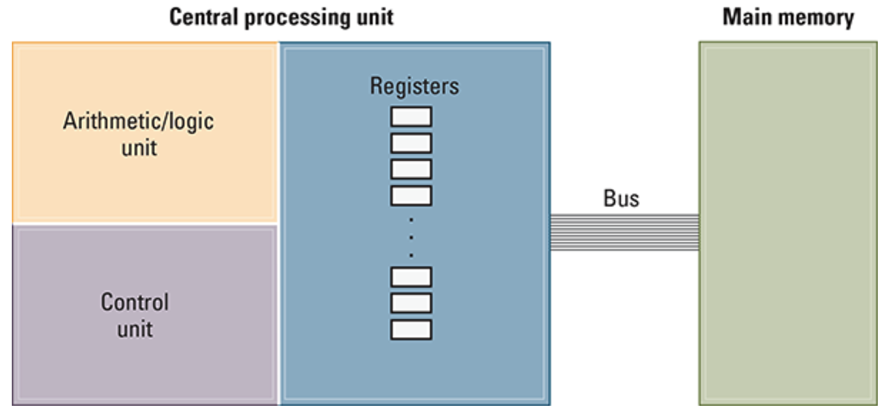

# 2.1 Computer Architecture
The circuitry in a computer that controls the manipulation of data is called 'central processing unit', or 'CPU' (often referred to as merely the processor).

## CPU Basics
A CPU consists of three parts: the `arithmetic/logic unit`, which contains the circuitry that performs operations on data (such as addition and substraction); the `control unit`, which contains the circuitry for coordinatiing the machine's activities; and the `register unit`, which contains data storage cells (similar to main memory cells), called `registers`, that are used for temporary storage of information within the CPU.

<em> CPU and main memory connected via a bus</em>

Some of the registers within the register unit are considered `general-purpose registeres` whereas others are `special-purpose registers`.  
General purpose registers serve as temporary holding places for data being manipulated by the CPU.  
For the purpose of transfering bit patterns, a machine's CPU and main memory are connected by a collection of wires or traces called a `bus`.

## The Stored-Program Concept
A sequence of bits may represent instructions or data. 
Cache Memory - It is instructive to compare the memory facilities within a computer in relation to their functionality. Registers are used to hold the data immediately applicable to the operaion at hand; main memory is used to hold data that will be needed in the near future; and mass storage is used to hold data that will likely not be needed in the immediate future. Many machines are designed with an additional memory level, called cache memory. `Cache memory` is a portion (perhaps several hundred KB) of high-speed memory located within the CPU itself.

# 2.2 Machine Language 
Machine language is a low-level programming language that consists of binary code or instructions directly understandable by a computer's hardware.

## The Instruction Repertoire 
There are two philosophies of CPU arhitecture.
- One is the CPU should be designed to execute a minimal set of machine instructions. This approach leads to whta is called `reduced instruction set computer (RISC)`.
- The second is the CPU's ability to execute a large number of complex instructions, even though many of them are technically redundant. The result of this approach is known as a `complex instruction set computer (CISC)`.  
Regardless of the choice between RISC and CISC, a machines's instructions can be categorized into three groupings: (1) the data transfer group, (2) the arithmetic/logic group, and (3) the control group.

## Data Transfer
The data transfer group consists of instructions that request the movement of data from one location to another.

## Arithmetic/Logic
The arithmetic/ logic group consists of the instructions that tell the control unit to request an activity within the arithmetic/logic unit.

## Control 
The control group consists of these instructions that direct the execution of the program rather than the manipulation of data.

# 2.3 Program Execution 

# 2.4 Arithmetic/Logic Instructions

# 2.5 Communication with other Devices

## The role of a controllers
Communication between a computer and other devices is normally handled through ab intermediary apparatus known as a `controller`.

## Direct Memory Access
The ability of a controller to access main memory is known as `direct memory access (DMA)`, and it is a significant asset to a computers performance.

## Handshaking
Handshaking is a constant two-way dialogue, in which the computer and the peripheral device exchange information about the device's status and coordinate their activities.

## Popular Communication Media
Communication betwen computing devices is handled over two tyoes of paths: `paralel` and `serial`.
In the case of parallel communication, several signals are transfered at the same time, each on a separate line.
In contrrast, serial communication is based on transferring signals one after the other over a single line.

## Communication Rates 
The rate at which bits are transferred from one computing component to another is measured in `bits per second (bps)`. Common units include `Kbps` (kilo-bps, equal to one thousand bps), `Mbps` (mega-bps, equal to one million bps), and `Gbps` (giga-bps, equal to one billion bps).

# 2.6 Programming Data Manipulation
Code in programming language is often translated into code in another (lower level) language to be executed on a computer.
## Functions
A function is a named grouping of programmin instructions.  
Functions are reusable programming abstractions.
