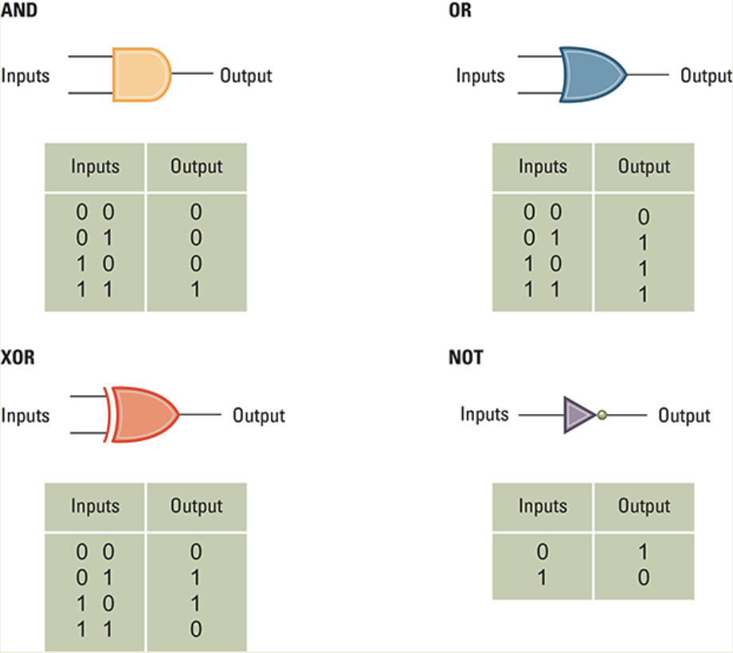

# Bits and Their Storage

- At the lowest level, all digital data are represented by bits.
- At a higher level, bits are grouped to represent abstractions, including but not limited to numbers, characters and color
- At one of the lowest level of abstrction, digital data is represented in binary (base 2) using only combinations of the digits an one.

## Boolean Opearions

Opearations that manipulate true/false values are called **Boolean operations**.

<em> The possible input and output values of Boolean operaions AND, OR, XOR (exclusive or)</em>

## Gates and Flip-Flops

- Logic gate is an electronic circuit that performs a logical operation on one or more inout signals to produce an output signal. 
The input and output signals of a logic gate are binary in nature, meaning they can only have one of two possible states: 'on' or 'off', 
'high' or 'low', 'true' or 'false'.

<em> A pictorial representaion if AND, OR, XOR, and NOT gates as well as their input and output values.</em>

- A Flip flop is a type of digital electronic circuit that is used to store a single bit of information. The term 'flip-flop' comes from the fact that can be in one of two stable states, which can be flipped back and forth by applying an appropriate inout signal.

<em> A simpe flip-flop circuit</em>

<em> Setting the output of a flip-flop to 1<em>

