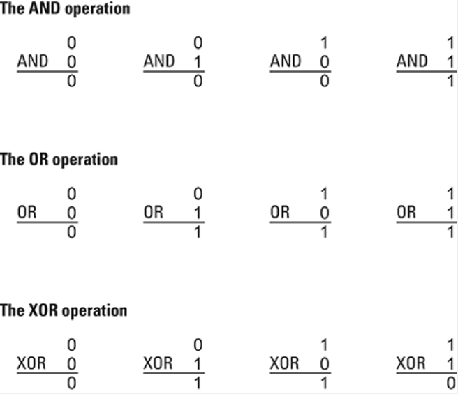

# Bits and Their Storage

- At the lowest level, all digital data are represented by bits.
- At a higher level, bits are grouped to represent abstractions, including but not limited to numbers, characters and color
- At one of the lowest level of abstrction, digital data is represented in binary (base 2) using only combinations of the digits an one.

## Boolean Opearions

Opearations that manipulate true/false values are called **Boolean operations**.

## Gates and Flip-Flops
