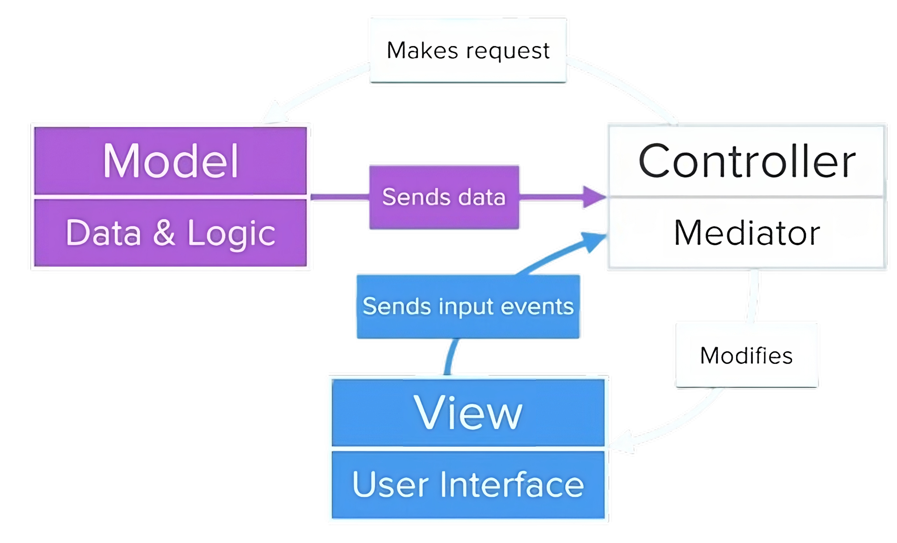

<h2>iOS App design patterns and code structuring</h2>

What is covered in this section

- Show quiz questions
- Check the answers
- Learn about Swift Structures
- Learn about design patterns and use the Model View Controller pattern.
- Learn about Swift Functions that can have outputs.
- Understand immutability.

---

<h5>Setting up the Quizzler Project and Showing the Questions</h5>

<p style="color: FireBrick">Start by linking the code with the design</p>

- Create an `IBOutlet` from my Qestion label as well as my progress view. inside the `UIViewController`
  - name the Question label `questionLabel`
  - name the Preogress view `progressView`
- Do the same for the true and false buttons. Named them `trueButton` and `falseButton`.
- Add IBAction when eiher the true or false button gets pressed.
  - Add the true button and false buttons, name it `answerButtonPressed`.

```swift
class ViewController: UIViewController {

    @IBOutlet weak var progressView: UIProgressView!
    @IBOutlet weak var questionLabel: UILabel!
    @IBOutlet weak var trueButton: UIButton!
    @IBOutlet weak var falseButton: UIButton!

    override func viewDidLoad() {
        super.viewDidLoad()
        // Do any additional setup after loading the view.
    }

    @IBAction func answerButtonPressed(_ sender: UIButton) {
    }
}
```

- Next step is creating an array `quiz`

```swift
let quiz = [
  "Four + Two is equal to Six",
  "Five - Three is greater that One",
  "Three + Eight is less tahn Ten"
]
```

- Track which question the user is currently reading by creaating a variable `questionNumber`

```swift
questionNumber = 0;
```

- Update the `questionLabel.text`

```swift
questionLabel.text = quiz[questionNumber]
```

- Create a new function `updateUi`

```swift
func updateUI () {
  questionLabel.text = quiz[questionNumber]
}
```

---

<h5>Checking Answers using 2-Dimensional Arrays</h5>

```swift
// 1D Array
  "Four + Two is equal to Six"
  "Five - Three is greater that One"
  "Three + Eight is less tahn Ten"

// 2D Array
  "Four + Two is equal to Six",         "True"
  "Five - Three is greater that One",   "False"
  "Three + Eight is less tahn Ten"      "False"
```

- Update the code

```swift
  let quiz = [
      ["Four + Two is equal to Six", "True"],
      ["Five - Three is greater that One", "True"],
      ["Three + Eight is less tahn Ten", "False"]
    ]
```

- Figure out what the user has chosen by creating a new variable `userAnswer`

```swift
// create the var in the `answerButtonPressed`

let userAnswer = sender.currentTitle // True, falses
```

- Create var `actualAnswer`

```swift
let actualAnswer = quiz[questionNumber][1]
```

- Create an if statement

```swift
if userAnswer == actualAnswer {
  print("Right")
} else {
  print("Wrong")
}
```

- Create another if statement

```swift
if questionNumber + 1 < quiz.count {
  questionNumber += 1
}

```

- Reset the `questionNumer` back to 0

```swift
if questionNumber + 1 < quiz.count {
  questionNumber += 1
} else {
  questionNumber = 0
}
```

---

<h5>Structures, Methods and Properties</h5>

Structures help us create custom data types.

```swift
// Defining the Structure
struct MyStruct {}

// Initialisng the Structure
MyStruct()
```

<details>
  <summary>Struct Example</summary>

```swift
struct Town {
  let name = "Todorland"
  var citizens = ["Todor", "Batman"]
  var resources = ["Grain": 100, "Ore": 42, "Wool": 42]

  func fortify() {
      print("Defences increased!")
  }
}

var myTown = Town()

print(myTown.citizens) // ["Todor", "Batman"]
print("\(myTown.name) has \(myTown.resources["Grain"]!) bags of grain")

myTown.citizens.append("John Wick")
print(myTown.citizens) // ["Todor", "Batman", "John Wick"]

myTown.fortify()

// The name, citizens and the resources are the properties of the struct
// fortifty is the method of the struct
```

</details>

Struct = Blueprint

```swift
// Creating the initialiser
init() {}

// Using the initialiser
StructureName()
```

<details>
  <summary>Init Example</summary>

```swift
struct Town {
    let name: String
    var citizens: [String]
    var resources: [String: Int]

    // Create the initialiser
    init(townName: String, people: [String], stats: [String: Int]) {
        name = townName
        citizens = people
        resources = stats
    }

    func fortify() {
        print("Defences increased!")
    }
}

var anotherTown = Town(townName: "Island", people: ["Tom Hanks"], stats: ["Coconuts": 100])
anotherTown.citizens.append("Wilson")
print(anotherTown.citizens)

```

</details>

<details>
  <summary>Init using "self" Example</summary>

```swift
struct Town {
    let name: String
    var citizens: [String]
    var resources: [String: Int]

    // Create the initialiser
    init(name: String, citizens: [String], resources: [String: Int]) {
        self.name = name
        self.citizens = citizens
        self.resources = resources
    }

    func fortify() {
        print("Defences increased!")
    }
}

var anotherTown = Town(name: "Island", citizens: ["Tom Hanks"], resources: ["Coconuts": 100])
anotherTown.citizens.append("Wilson")
print(anotherTown.citizens)


```

</details>

---

<h5>Creating a Question Struct</h5>

Create a new file swift file called `Question`.

```swift
struct Question {
  let text: String
  let answer: String
}
```

Initialize the Question struct in the `Main` file.

```swift
let quiz = [
  Question(text: "Four + Two is equal to Six", answer: "True"),
  Question(text: "Five - Three is greater that One", answer: "True"),
  Question(text: "Three + Eight is less tahn Ten", answer: "False")
]
```

---

<h5>Giving the user feedback and working with a ProgressView</h5>

Related to Step 4 in the step by step guide.

---

<h5>Understanding the MVC design pattern</h5>

Design patterns - can help us get organized and structure our code in a better way.
Design pattern is a proven solution to a common problem (usually the common problem is complexity)

MVC (model view controller) design pattern
The project is split in three main components

- The model (data & logic)
- The view (user intrerface)
- The controller (mediator)



---

<h5>Implementing the MVC design pattern</h5>

Refer to step 5 and 6.

---

<h5>Functions with Outputs and Return Types</h5>

```swift
// Creating the function
func getMilk (money: Int) -> Int {
  let change = money  2;
  return change;
}

// `->` - Return arrow
// `Int` - Return type
// `return` - Return keyword
// `change` - Return value
```

```swift
// Calling the function
var change = getMilk(4)
```

---

<h5>Refactoring to Implement the MVC Design Pattern</h5>

---

<h5>Immutability</h5>

```swift
// questionNumbe is the property of the QuizBrain
// checkAnswer is the method of the QuizBrain

struct QuizBrain() {
  var questionNumber = 0

  func checkAnswer(userAnswer: String) -> Bool{
    if userAnswer == quiz[questionNumber].answer {
      // User got it right
      return true
    } else {
      // User got it wrong
      return false
    }
  }
}
```

Things marked with `var` are mutable, things marked with `let` are immutable.

---

<h5>Using mutability functions to track the score</h5>

---
