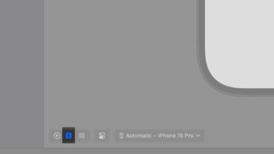
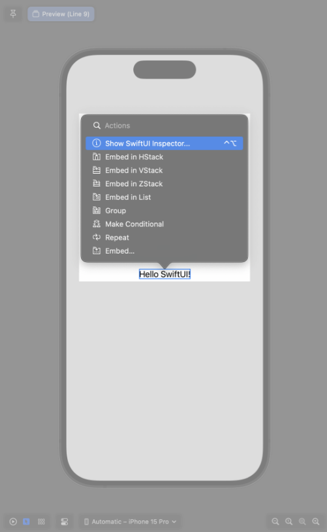
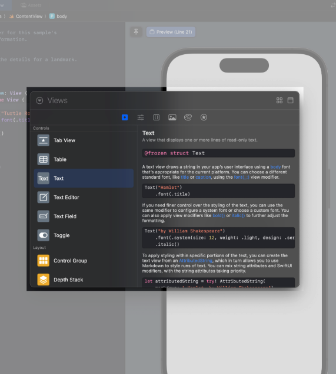

## SwiftUI essentials

### Section 1: Create a new project and explore the canvas

Step 1:
Open Xcode and either click "Create New Project" in Xcode's startup window, or choose File -> New -> Project.

Step 2:
In the template selector, select iOS as the platform, select the App template, and then click Next.

Step 3:
Enter "Landmarks" ase the product name, select "SwiftUI" for the interface and "Swift" for the language, and click NEXT Choose a location to save the Landmarks project on your Mac.

Step 4:
In the Project navigator, select `LandmarksApp`.

An app that uses the SwiftUI app life cycle has a structure that conforms to the App protocol. The structure's body property returns one or more scenes, which in turn provide content for display.
The @main attribute identifies the app's entry point.

Step 5:
In the Project navigator, select `ContentView`.

By default, SwiftUI view files declare a structure and a preview. The structure conforms to the View protocol and describes the view's content and layout. The preview declaration creates a preview for that view.

Step 6:
The canvas displays a preview automatically.

<span style="color: teal">Tip</span>

If the canvas isn't visible, select Editor > Canvas to show it.

Step 7:

Inside the body property, remove everything but the Text declaration and change "Hello, world!" to a greeting for yourself.

As you change the code in a view's body property, the preview updates to reflect your changes.

## Section 2: Customize the text view

Step 1:
Change the canvas mode to Selectable.
The canvas displays previews in Live mode by default so that you can interact with them, but you can use the Selectable mode to enable editing instead.



Step 2:
In the prview, Command-Control-click the greeting to bring up the structured editing popover, and choose "Show SwiftUI Inspector".
The popover shows different attributes that you can customize, depanding on the type of view you inspect.



Step 3:
Use the inspector to change the text to "Turtle Rock", the name of the first landmark you'll show in your app.

Step 4:
Change the Font modifier to "Title".
This applies the system font to the text so that it responds correctly to the user's preferred font sizes and settings.

Step 5:
Edit the code by hand to add the `foregroundColor(.green)` modifier; this changes the text color to green.

Step 6:
This time, open the inspector by Control-clicking on the Text declaration in the code editor, and then choose “Show SwiftUI Inspector” from the popover. Click the Color pop-up menu and choose Inherited to change the text color to black again.

Step 7:
Notice that Xcode updates your code automatically to reflect the changes, remove the `foregroundColor(.green)` modifier.

Step 8:
Set the preview back to Live mode.
Working in Live mode makes it easy to keep track of view behavior as you make edits in source.

## Section 3: Combine views using stacks

In this section, you'll use a vertical stack to place the title above a horizontal stack that contains details about the park.

Step 1:
Control-click the text view's initializer to show a context menu, and then choose "Embed in VStack"

Step 2:
Open the library by clicking the plus button (+) at the top-right of the Xcode window, and then drag a Text view to the place in your code immediately below the "Turtle Rock" text view.



Step 3:
Replace the Text view's placeholder text with "Joshua Tree National Park"

Step 4:
Set the location's font to subheadline.

```swift
import SwiftUI

struct ContentView: View {
    var body: some View {
        VStack {
            Text("Turtle Rock")
            Text("Joshua Tree National Park").font(.subheadline)
        }
    }
}

#Preview {
    ContentView()
}
```

Step 5:
Edit the VSStack initializer to align the views by their leading edges.
By default, stacks center their contents along their axis and provide context-appropriate spacing.

```swift
VSta§ck (alignment: .leading) {
    Text("Turtle Rock")
    Text("Joshua Tree National Park").font(.subheadline)
}
```

Step 6:
Embed the "Joshua Tree National Park" text view in an HStack.

```swift
HStack {
    Text("Joshua Tree National Park").font(.subheadline)
}
```

Step 7:

Add a new text view after the location, change the placeholder text to the park's state, and then set its font to subheadline.

```swift
HStack {
    Text("Joshua Tree National Park").font(.subheadline)
    Text("California").font(.subheadline)
}
```

Step 8

To direct the layout to use the full width of the device, separate the park and the state by addding a `Spacer` to the horizontal stack holding the two text views.

A `spacer` expands to make its containing view use all of the space of its parent view, instead of having it's size defined only by its contents.

```swift
HStack {
    Text("Joshua Tree National Park").font(.subheadline)
    Spacer()
    Text("California").font(.subheadline)
}
```

Step 9

Finally, use the `padding()` modifier to give the landmark's name and details a little more space around their outer edges.

```swift
struct ContentView: View {
    var body: some View {
        VStack(alignment: .leading) {
            Text("Turtle Rock")
                .font(.title)
            HStack {
                Text("Joshua Tree National Park")
                    .font(.subheadline)
                Spacer()
                Text("California")
                    .font(.subheadline)
            }
        }
        .padding()
    }
}

```

## Section 4: Create a custom image view

With the name and location views all set, the next step is to add an image for the landmark.

Instead of adding more code in this file, you'll create a custom view that applies a mask, border, and drop shadow to the image.

Step 1
Find `turtlerock@2x.jpg` in the project files 'Resources folder', drag it into the asset catalog's editor. Xcode creates a new set for the image.

Step 2

Choose Files -> New -> File to open the template selector again. In the User Interface section, select "SwiftUI Views" and click Next. Name the file CircleImage.swift and click Create.

Step 3
Replace the text view with the image of Turtle Rock by using the Image(...C) initializer, passing it the name of the image to display.

Step 4
Add a call to clip Shape(Circle()) to apply the circular clipping shape to the image.

The Circle type is a shape that you can use as a mask, or as a view by giving the circle a stroke or fill.

Step 5
Create another circle with a gray stroke, and then add it as an overlay to give the image a border.

```swift
struct CircleImage: View {
    var body: some View {
        Image("turtlerock")
            .clipShape(/*@START_MENU_TOKEN@*/Circle()/*@END_MENU_TOKEN@*/)
            .overlay {
                Circle().stroke(.gray, lineWidth: 4)
            }
    }
}
```

Step 6

Next, add a shadow with a 7 point radius.

```swift
.shadow(radius: 7)
```

Step 7

Switch the border color to white.

This completes the image view.

## Section 5: Use SwiftUI views from other frameworks

Step 1
Choose File -> New -> File. select iOS as the platform, select the "SwiftUI View" template, and click Nexr. Name the new file MapView.swift and click Create

Step 2

Add an import statement for MapKit.

When you import SwiftUI and certain other frameworks in the same file, you gain access to SwiftUI-specific functionality provided by that framework.

```swift
import SwiftUI
import MapKit

struct MapView: View {
    var body: some View {
        Text(/*@START_MENU_TOKEN@*/"Hello, World!"/*@END_MENU_TOKEN@*/)
    }
}

#Preview {
    MapView()
}

```

Step 3

Create a private computed variable that holds the region information for the map.

```swift
private var region: MKCoordinateRegion {
    MKCoordinateRegion(
        center: CLLocationCoordinate2D(latitude: 34.011_286, longitude: -116.166_868),
        span: MKCoordinateSpan(latitudeDelta: 0.2, longitudeDelta: 0.2)
    )
}
```

Step 4

Replace the default Text view with a Map view that takes a camera position that you initialize with the region.

```swifit
var body: some View {
    Map(initialPosition: .region(region))
}
```

Step 5

You'll see a map centered on Turtle Rock in the preview.

You can manipulate the map in live preview to zoom out a bit and seethe surrounding area using the Opinion-clickdrag control.

## Section 6: Compose the detail view

Step 1:

In the Project navigator, select the Content View file.

Step 2:

Embed the VStack taht holds the three text views in another VStack.

```swift
VStack {
    VStack(alignment: .leading) {
        Text("Turtle Rock")
            .font(.title)
        HStack {
            Text("Joshua Tree National Park")
                .font(.subheadline)
            Spacer()
            Text("California")
                .font(.subheadline)
         }
    }
    .padding()
}
```

Step 3:

Add your custom MapView to the top of the stack. Set the size of the MapView with frame(width:height)

When you specify only the height perimeter, the view automatically ized to the width of its content.

```swift
MapView()
    .frame(height: 300)
```

Step 4:

Add the `circleImage` view to the stack

```swift
CircleImage()
```

Step 5

To layer the image view on top of the map view, give the image an offset of -130 points vertically, and padding of -130 points from the bottom of the view.
