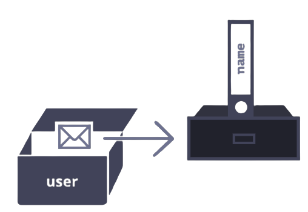

### Chapter 4.2.1 Object reference and copying

One of the fundamental differences of objects versus primitives is that objects are stored and copied 'by reference', whereas primitive values: string, numbers, booleans, etc. - are always copied 'as a whole value'.

For example, lets' start with a primitive, such as a string.

Here we put a copy of `message` into `phrase`:

```js
let message = "Hello";
let phrase = message;
```

As a result we have two independent variables, each oone storing the string `'Hello'`.

Objects are not like that.

`A variable assigned to an object stores not hte object itself, but its "address in memory" - in other words "a reference" to it`.

Let's look at an example of such a variable.

```js
let user = {
  name: "John",
};
```



The object is stored somewhere in memory (at the right of the picture), while the `user` variable (athe the left) has a 'reference' to it.

`When an object variable is copied, the reference is copied, but the object itself is not duplicated.`

For instance:

```js
let user = { name: "John" };

let admin = user; // copy the reference
```


As you can see, there's still one object, but now with variables that reference it.

---

### Chapter 4.2.2 Comparison by reference

Two objects are equal only if they are the same object.

For instance, here `a` and `b` reference the same object, thus they are equal:

```js
let a = {};
let b = a; // copy the reference

alert(a == b); // true, both variables reference the same object
alert(a === b); // true
```

And here two independent objects are not equal, even though they look alike (bot are empty)

```js
let a = {};
let b = {}; // two independent objects

alert(a == b); // false
```

---
