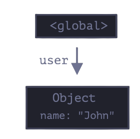

## 4.3.1 Reachability

Simply put, "reachable" values are those that are accessible or usable somehow.

1. There's base set of inherently reachable valuesm that cannot be deleted for obvious reasons.
   For instance:

- The current executing function, its local variables and parametres
- Other functions on the current chain of nested calls, their local varialbes and parameters.
- Global varialbes.

2. Any other value is considered reachable if it's reacahble from a root by a reference or by a chain of reference.

There's a background process in the JS engine that is called `garbage collector`.
It monitors all obkects and removes those that have become unreachable.

## 4.3.2 A simple example

```js
// user has a reference to the object
let user = {
  name: "John",
};
```



Here thearrow depicts an object reference. The global variable `"user"` references the object `{name" "John"}`.

If the value of `user` is overwritten, the reference is lost:

```js
user = null;
```


Now John becomes unreachable. There's no way to access it, no reference to it.
Garbage collector will junk the data and free the memory.

## 4.3.3 Two references

Now let's imagine we copied that reference from `user` to `admin`

```js
// user has a reference to the object
let user = {
  name: "John",
};

let admin = user;
```


Now if we do the same:

```js
user = null;
```

...Then the object is still reachable via `admin` global vatiable, so it must stay in memory. If we overwritte `admin` too, then it can be removed.
